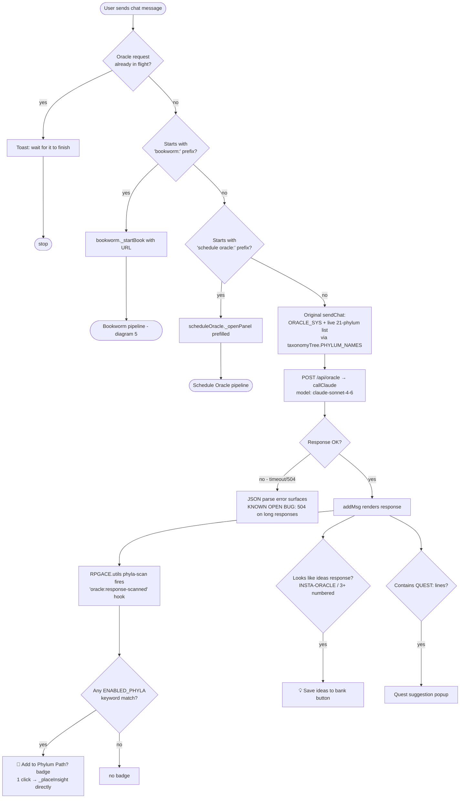
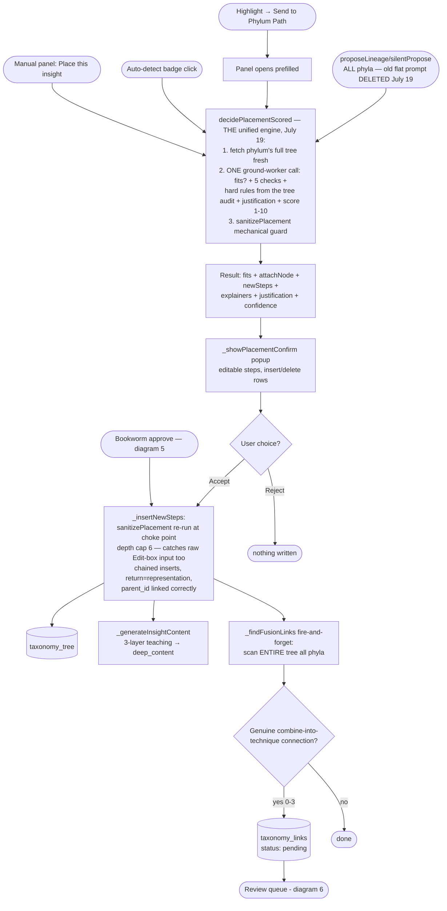
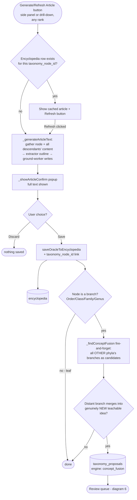
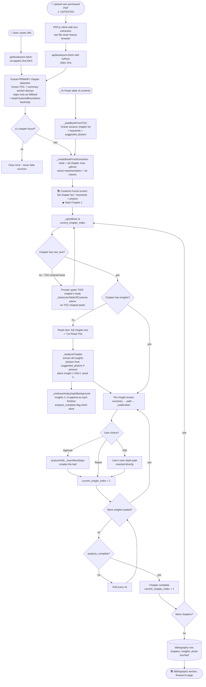
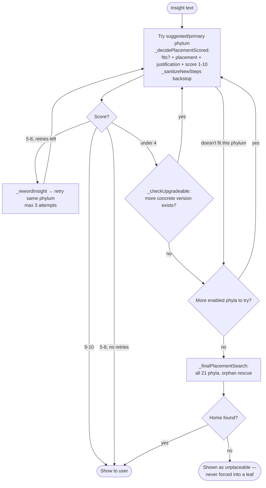
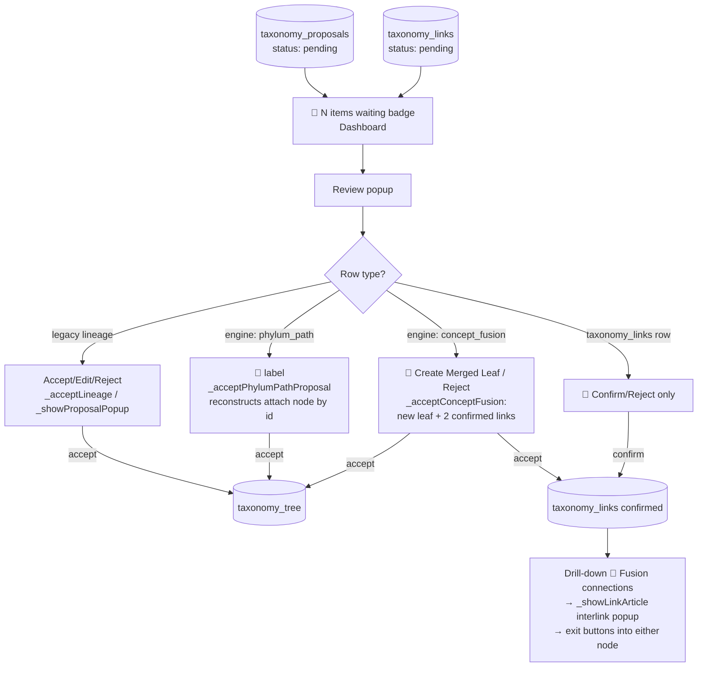
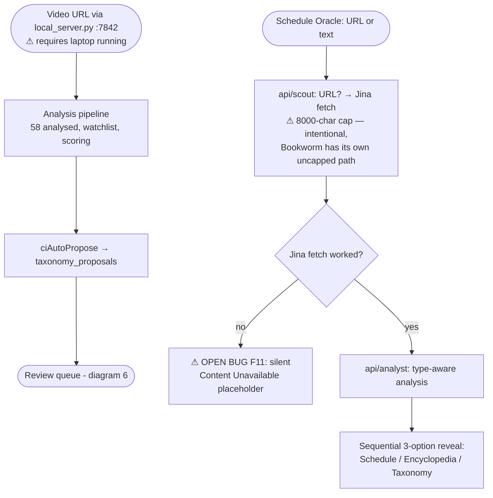
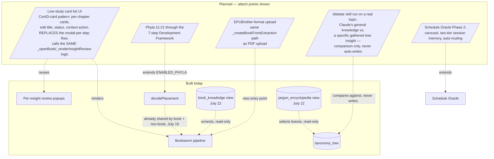
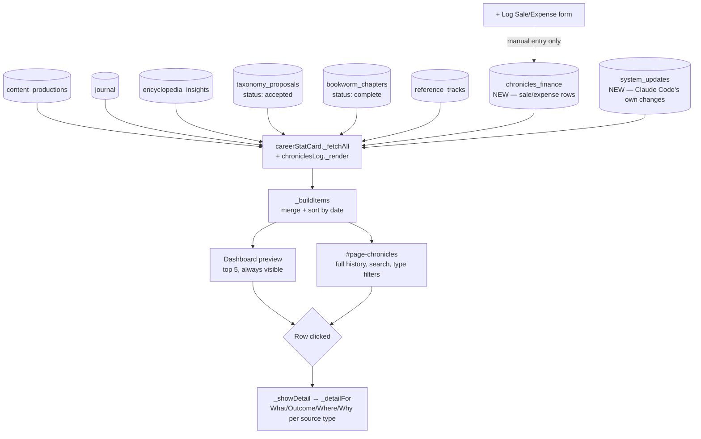

# RPGACE — System Flow Map
**The 5th Oversight doc.** Created July 17, 2026 from a full audit of all oversight files + the live codebase (`main.js`, `rpgace_core.js`, `api/*`, `index.html`). **Last re-verified July 24, 2026** (hygiene pass, item 10 of the `/Routine`-produced daily Top 10) — the body has been edited well past the creation date on multiple sessions since; this line now gets bumped whenever a real re-verification pass runs, not just on creation. Diagrams are Mermaid — render on GitHub, in VS Code, or any Mermaid viewer. Every diagram follows the same convention: **rectangles = processing**, **diamonds = yes/no decisions**, **cylinders = data stores**, **stadiums = entry/exit points**, **dashed boxes = PLANNED, not built**.

Companion to CLAUDE.md (the operational guide). Update BOTH when architecture changes.

---

## 0. Verified Component Inventory

**Module count corrected July 24 with real evidence** (`grep -c "RPGACE.register("` against actual name-bearing calls, excluding comment mentions): **52 real registered modules** in `rpgace_core.js`, not the July 17 table's stale ~30, and more precise than the earlier "51+" estimate. Newer modules confirmed real: `authGate`, `pathRouter`, `perfWatch`, `researchTabs`, `chroniclesLog`, `careerStatCard`, `dashDeck`, `leftNav`, `oracleAppGrounding`, `oracleDevBridge`, `oracleFetchGuard`, `pwaInstall` — not yet folded into the domain table below (a full per-module table rebuild is a bigger task than this hygiene pass scoped for; the count itself is now real and current).

### Domains and modules (from `rpgace_core.js` markers, verified by grep July 17 — SEE STALE NOTE ABOVE)

| Domain | Modules |
|---|---|
| ORACLE | youtubeOracle, prodOraclePanel, instaOraclePanel, quickActions, visualOracle, contentRepurpose |
| LEARNING | feynman, encSync, ciAutoPropose, taxonomyReviewQueue, encTaxonomyLink, agendaReminder, scheduleOracle, intelDelete, taxonomySync, knowledgeGap, taxonomyTree, phylumPath, bookworm |
| CONFIG | config (defines `RPGACE.sb`, `RPGACE.cache`, `RPGACE.hooks`, CONFIG constants) |
| CONTENT | beatLog, refCorpus, contentProductionLive, videoPipeline, conidPot |
| JOURNAL | morningBrief |
| SYSTEM | suppressQuestPopup, restoreSendChat, docsLinks |
| SCHEDULE | shiftSync |

### Serverless API (`api/`)
`oracle.js` (Claude proxy, accepts optional `model`), `scout.js` (URL detect + Jina fetch, 8000-char cap), `analyst.js`, `bookworm-fetch.js` (uncapped fetch OR provided fullText → Oracle chapter detection), `composio.js`, `executor.js`, `orchestrate.js`, `noter.js`, `search.js`, `lastfm.js`, `auth.js` (**NEW July 23** — server-side password check + shared-secret issuance, see §10's API-auth entry), `_context.js` (shared: `callClaude`, `MODEL='claude-sonnet-4-6'`, `MODEL_EXTRACTOR='claude-fable-5'`, `fetchURL`, `setCORS`, **`requireAuth` NEW July 23**, Composio `ACCOUNTS`/`TOOL_ALIASES` — single source of truth as of July 23's deduplication fix).

### Supabase tables
`taxonomy_tree` (recursive, parent_id/depth/path/phylum_number/node_type/explainer/deep_content/sources), `taxonomy_proposals` (staging + review, `proposed_steps.engine` tags: legacy / `phylum_path` / `concept_fusion`), `taxonomy_links` (symmetric fusion links + `link_article`), `taxonomy_nodes` (older flat store, still read by some features), `encyclopedia` (`taxonomy_node_id` links), `content_productions` (ConID + licence/price), `video_jobs` (F17), `rpgace_shifts`, `rpgace_agendas`, `bookworm_books`, `bookworm_chapters` (+keywords, suggested_phylum, analysis_complete), `bibliography`, `intel_bibliography` (Content Intelligence's OWN separate bibliography — real, unrelated table sharing a near-identical name with `bibliography`, found by the July 23 audit), `chronicles_finance`, `system_updates`, `oracle_dev_suggestions`, `taxonomy_decision_log` (all July 22), `book_knowledge`/`jargon_encyclopedia` (Postgres views, July 22).

### The two real hubs (confirmed in interconnection_map.md)
Everything converges on **Oracle** (`callOracle`/`sendChat`/`api/oracle.js`) and the **Taxonomy Tree** (`taxonomy_tree` + its propose/review cycle) — except SCHEDULE, which runs fully independent.

---

## 1. Top-Level System Map

```mermaid
flowchart TD
    subgraph INPUTS[Input Surfaces]
        CHAT([Oracle chat])
        PANELS([Oracle panels: Prod/Insta/YouTube/Visual])
        CI([Content Intelligence video URL])
        SCHED([Schedule Oracle: URL/text])
        BW([Bookworm: URL / TOC paste / PDF upload])
        MANUAL([Manual: Beat Log, ConID, shifts, agendas])
        HIGHLIGHT([Text-select highlight])
    end

    subgraph PROCESS[Processing Core]
        ORACLE[callOracle / api/oracle.js<br/>+ extractor/ground-worker 2-tier for Phylum Path]
        SCAN[Shared phyla-scan<br/>oracle:response-scanned hook]
        PLACE[phylumPath.decidePlacement<br/>5-check reasoning]
        REVIEW[taxonomyReviewQueue<br/>3 card types + fusion links]
    end

    subgraph STORES[(Data)]
        TREE[(taxonomy_tree)]
        PROPS[(taxonomy_proposals)]
        LINKS[(taxonomy_links)]
        ENC[(encyclopedia)]
        CONID[(content_productions)]
        BOOKS[(bookworm_books/chapters)]
        BIB[(bibliography)]
    end

    subgraph OUTPUTS[Output Surfaces]
        DRILL([Phylum Path nav-tab drill-down])
        DASH([Dashboard widgets])
        ENCPG([Encyclopedia page])
        TAXMAP([taxonomy_map.html - live query])
    end

    CHAT --> ORACLE
    PANELS --> ORACLE
    HIGHLIGHT --> PLACE
    CI --> SCAN
    SCHED --> ORACLE
    BW --> PLACE
    ORACLE --> SCAN
    SCAN -->|badge clicked| PLACE
    PLACE -->|confirmed| TREE
    PLACE -->|staged| PROPS
    PROPS --> REVIEW
    REVIEW -->|accept| TREE
    REVIEW -->|accept fusion| LINKS
    TREE --> DRILL
    TREE --> TAXMAP
    ORACLE -->|articles| ENC
    ENC --> ENCPG
    MANUAL --> CONID
    BW --> BOOKS
    BOOKS -->|book complete| BIB
    LINKS --> DRILL
    CONID --> DASH
    BOOKS --> DASH
```

---

## 2. Oracle Chat Request Flow (`main.js sendChat` + wraps)



---

## 3. Phylum Path Insight Placement (the core taxonomy write path)



---

## 4. Article Generation + Concept Fusion



---

## 5. Bookworm (whole-book → taxonomy pipeline)



**Insight placement cascade inside `_analyzeChapter`** (per insight):



---

## 6. Review Queue (Dashboard — all pending taxonomy decisions)



---

## 7. Content Intelligence & Schedule Oracle ingestion



---

## 8. PLANNED features (dashed = not built) and where they attach



**July 22 correction**: the "Taxonomy Sorting Agent" and "Claude general-knowledge audit" nodes that used to sit in the PLANNED subgraph above are gone — tracing the real call chain showed `decidePlacement` already IS the one shared engine for book and non-book inputs (no separate agent was ever needed), and the general-knowledge audit was redesigned around `/debate` (comparison only, gated behind an explicit human decision to ever write anything) rather than the original 3-part tree-seeding design. `book_knowledge` and `jargon_encyclopedia` — what the Sorting Agent was actually described as blocking — are both shipped, read-only Postgres views over data already written by the existing pipeline above.

---

## 9. The Chronicles (activity-log aggregation + finance ledger) — added July 22



Real design choice, not an oversight: `chronicles_finance` feeds Chronicles' display but is deliberately **excluded** from the career-score XP/Level formula computed in the same `_fetchAll` pass — confirmed via interrogation this is a separate visibility lane. `bookworm_chapters` feeds the cumulative Growth *count* but is excluded from the streak/recent-activity date logic (its `created_at` is a bulk-insert timestamp from TOC detection, not real per-chapter completion time — would show a misleading date otherwise).

---

## 10. Built vs NOT built — the truth table (July 17, post-audit)

### Built AND verified working (hand-tested or confirmed live)
- 10-phylum Phylum Path: switcher, drill-down, placement, confirm popups, auto-detect badge (1-click as of today)
- Placement logic hand-tested across 8 of 10 enabled phyla (data-layer)
- Concept Fusion full propose→accept cycle (data-layer)
- Fusion links: creation, review, display (**21 confirmed / 47 pending, 68 total** — corrected July 20 by direct SQL from the stale "6 confirmed" figure)
- Review queue with all 3 proposal types + link cards
- Bookworm: streaming analysis (verified <1 min to first insight), delete button, checkpoint/resume, placement-path sanitizer
- **Bookworm full insight-review loop, July 18: `_analyzeChapter` → Council-of-5 scored placement → Approve/Reject/Edit checkpoint → live `taxonomy_tree` write, confirmed end-to-end on a real chapter** (1 genuine reject, 2 genuine approvals) — manual/TOC-paste book only, see caveat below
- TOC-paste chapter detection (`_startBookFromTOC`) — confirmed correct on a real full 27-chapter book, July 18
- **PDF-upload chapter detection, rebuilt and fully verified July 18: `detectChapterListByOracle()` + `resolveChapterHeadingsMechanically()`** — 26 of 26 real chapters, correct titles, correct reading order, zero warnings, on a real 400,000+ character book with two distinct real PDF-text-corruption patterns present (words joined with no space, words split with an inserted space). The longest debugging arc in Bookworm's history (8 real rounds, each diagnosed from Vercel logs/Supabase queries/Alex's own pasted raw text, never a blind second guess) — see patch_notes.html's 🏁 finish-line card for the full account.
- Grounded Oracle (no more invented phyla), request cross-wiring guard
- Content Intelligence end-to-end; cross-device sync (shifts, agendas)

### Built but NEVER verified — treat as unconfirmed, test before building on
- **Left slide-out nav drawer (`leftNav` module, July 20) replacing the top `.nav-tabs` bar** — 9 top-level pages + nested Research/Schedule sub-navs, reasoning-verified (z-index stacking, main.js no-op safety, patch-level code review) but never opened in a real browser.
- **Research Lab tab-content fix (July 20)** — Idea Bank/Corpus/Beat Log were nested inside `#video-workshop-panel` (hidden whenever another tab was active) and Bibliography was rendering above the page title on every visit; both root causes fixed, plus 4 modules' cold-load init reactivated (dead `rpgace:ready` listener pattern). Code-reviewed correct, not yet clicked through live.
- **Dashboard command deck (`dashDeck`, July 20, 5 commits)** — 11-card grid, widget-relocation popups, quest board moved to Agenda. Passes 1/1.5 were seen live by Alex (he reported real bugs against them); the relocation pass, the popup-close fix, and pass 2 have never been viewed in a browser.
- **Bookworm's chapter-by-chapter read→insight→approve loop, on the PDF-upload book — the combined run DID happen (July 19, corrected July 20).** Direct Supabase check of `bookworm_chapters` for book_id `70fd8faa-…531baa` ("Music Theory for Computer Musicians") shows chapter_index 7/9/12 (human chapters 8/10/13) all `status=complete` with 17/10/12 insights (39 total), plus chapter 1 (index 0) `in_progress` at 6 insights. So chapter detection AND the insight-review loop HAVE now run together on the same real PDF book — but on the **OLD pre-retune, pre-July-20-UI engine** (these are literally the garbage runs — ch-13 fragmentation, ch-1 shoehorning — that triggered the July 19 tree audit + token retune). The real open test is narrowed accordingly: **one clean chapter through the POST-retune unified engine + the July 20 dashboard/nav UI** (resume chapter 1 or open the next unstudied chapter) — NOT a first-ever combined run, which already exists. (Housekeeping: a duplicate `bookworm_books` row for the same book, id `87268196-…845513f`, all chapters pending / zero real progress — harmless; real progress lives on the other book_id.)
- `_looksLikeTableOfContents()` warning heuristic — never observed catching the real mistake
- Bookworm end-to-end: **no book has ever completed the full pipeline** (structure detection is now solid on both entry points; still no book has been walked start to finish)
- Bibliography section render (no completed book exists to show)
- `bookworm:` chat trigger; browser-side render of concept-fusion/fusion-link review cards; interlink article popup; grouped phylum switcher; drill-down Back button — all built this session, none re-clicked after building
- F16 Beatstars listing, F17 video pipeline stages, F18 auto visual treatment, highlight-to-Phylum-Path button (pending since July 13-15)
- **`book_knowledge` + `jargon_encyclopedia` views + the Jargon Encyclopedia button (July 22)** — real row counts confirmed via direct query (33/150), `security_definer_view` lint found and fixed, real headless Playwright run confirmed the button/popup/graceful-failure path — but never clicked through by Alex in a real browser.
- **`/debate` skill (July 22)** — built and code-reviewed, never actually run on a real topic yet (Alex asked to hold off rather than pick one this pass).
- n8n rota sync (F10) — importable, never test-run
- **Oracle self-awareness + Claude Code bridge (July 22, 6 pieces, none hand-tested):** `oracleAppGrounding` (dashboard/status grounding), `oracleFetchGuard` (fetched-content prompt-injection hardening), `oracleDevBridge` (Flag-for-Claude-Code button + `oracle_dev_suggestions` table), `taxonomy_decision_log` audit-log write hook at `_insertNewSteps`, Council of 5's conversation-capture button (`fillGaps` `opts.allowConversationCapture`), and the daily Morning Brief Routine (fires for real tomorrow morning for the first time). `node --check` clean on every pass; zero of it clicked through live yet.
- **Nav-lag root cause fixed twice, same day (July 22)** — a live crash from an early sidebar fix (module registration aborted mid-parse) was reverted, then root-caused for real (`leftNav`/`config` init-order race, defensive guard + retry added). A separate, deeper report ("nav doesn't respond for ~10s after login") traced `onReady()` to gating the whole module-registration cascade behind `window.load` (every image/font) instead of `DOMContentLoaded` — a systemic fix improving every module's startup, verified via real headless Playwright runs (not just code review, unlike the July 20 entries above).
- **RPGACE is now an installable PWA (July 22)** — `manifest.json` + `sw.js` (network-first, deliberately not cache-first) + generated icon set + a boot-loader overlay gating the login screen until every module has registered. Verified end-to-end via headless Playwright (boot loader hides, gate appears, login succeeds, nav responds instantly) — **never installed on a real Android device by Alex yet.**
- **Career stat card + The Chronicles (July 22)** — the profile card's HP/MP/Streak (confirmed 100% cosmetic, never touched by any code) and XP/Level (in-memory only, reset every load) replaced with a real weighted score from Supabase (Output = shipped content, Growth = learning/tree activity, kept as separate lanes). "Recent Wins" renamed The Chronicles, given a full searchable `#page-chronicles` log page with click-through detail on every real entry, plus a new `chronicles_finance` ledger table for personal-visibility sale/expense tracking. Verified via real headless Playwright runs (navigation, form validation, network-failure fallback) — **never viewed in a real browser by Alex.**
- **`/scope` skill + `system_updates` table (July 22)** — a reusable oversight-evidence-gathering skill, and a new Supabase table so Chronicles now also shows Claude Code's own real changes to RPGACE, not just Alex's in-app activity. This whole truth-table update was itself produced using `/scope`'s own methodology.
- **`/5thDimension` skill + Oracle command (July 23)** — a 6-phase meta-protocol reconciling built-vs-reported state, built from GODMODE/Council of 5/Omnitrix/Aintergration/`/scope`/`/debate` run in sequence. Ran once end-to-end (Phases 1-4): found near-zero real doc-vs-code drift, plus 7 smaller real findings and a prioritized rewiring debate. Also added as the 16th RPGACE Oracle AI command, scoped honestly to what Oracle can verify from its own live grounding vs. what needs a real Claude Code session.
- **API auth + password moved server-side (July 23, Tier 3, Alex-authorized "do now") — BUILT, node --check clean, tested via a mock Vercel-shaped server + real headless Playwright through the actual login UI end-to-end, but NOT merged to `main` / NOT live** — see the deployment-gate note above. `main.js`'s `checkPassword()` is a deliberate, logged FROZEN-file exception.
- **Deduplication fix in `api/composio.js`/`api/search.js` (July 23)** — found while applying new CLAUDE.md rule 8: `composio.js` had its own divergent `ACCOUNTS` map that had drifted from `_context.js`'s copy, meaning `executor.js`/`orchestrate.js` had silently been using the wrong Gmail/Instagram connected-account ids since a June 28 Composio update. Fixed; `_context.js` is now the single source of truth. Playwright/`node --check` verified; not yet live (bundled with the API-auth commit above, same deployment gate).
- **Research Lab real single-tab lazy loading (July 23)** — reverses a July 22 decision; 6 sub-modules gated behind a new `research:tab-active` hook instead of loading regardless of active tab. A genuine dead-code bug (`researchTabs._inject()` never called) fixed in the same pass. New `dashDeck._openResearch()` popup. Playwright-verified; never clicked through live by Alex.
- **Chronicles card-only + pathRouter (real URLs) + swipeable nav + `perfWatch` diagnostic (July 23)** — the old standalone Chronicles feed is gone, real pushState URLs shipped, left-nav gained a swipe gesture, and a passive `PerformanceObserver('longtask')` watcher now reports real main-thread freezes as a visible toast. Playwright-verified; a real freeze on the swipe gesture specifically (confirmed via `perfWatch`'s own toast, 23s) is still open, not yet root-caused.
- **Oracle self-awareness partially made live (July 23)** — real module count + a live taxonomy-backlog number now append to `oracleAppGrounding`'s digest, fail-open if unavailable. Playwright-verified; never viewed in a real Oracle conversation by Alex.

### Claimed/discussed but NOT built — do not trust any doc that implies otherwise
- Live-study **card-list UI** (ConID-card pattern for Bookworm chapters) — explicitly deferred today
- Schedule Oracle Phase 2 (F12); Circles rabbit-hole nav (folded into Phase-2 vision); dedicated case-study/reference-tracks phylum; phyla 11-21 framework passes; `hooks.on('rpgace:ready')` ~25-site audit; Oracle 504 root fix (streaming/chunking); dead streaming-code cleanup (`restoreSendChat`)
- ~~Taxonomy Sorting Agent; Claude general-knowledge audit (3 parts)~~ — **moved July 22**: see the "Built but NEVER verified" section below (`book_knowledge`/`jargon_encyclopedia` views + the `/debate` skill).
- ~~Server-side API authentication; `CORRECT_PW` moved server-side~~ — **moved July 23, BUILT (see "Built but NEVER verified" below)**: both fixed as one architecture change (`api/auth.js` + `requireAuth()` + `authGate`'s fetch wrap). Real deployment gate, not a code gap anymore: needs two Vercel env vars (`CORRECT_PW`, `RPGACE_API_SECRET`) before it can merge to `main` — see CLAUDE.md's urgent flag.
- **XSS/DOM-injection audit of `innerHTML` call sites** — flagged July 22, not investigated. Distinct from the (fixed) prompt-injection risk: whether any fetched external content (Jina text, YouTube transcripts, Oracle's own rendered replies) ever reaches an `innerHTML` assignment unescaped is a real open question.
- **Website performance audit** — no Lighthouse/PageSpeed run has ever been done; `rpgace_core.js` alone is ~15,700+ lines.
- **RLS policy redesign** (July 23 audit finding) — every RLS-"enabled" table actually uses a permissive `USING(true)` policy, not just the 3 fully-disabled ones CLAUDE.md names by name. Real design work needed, not a blind `ENABLE ROW LEVEL SECURITY`.
- **Live-grounding for RLS/security status specifically** — deliberately not built July 23 (Supabase's advisor API isn't reachable from client-side browser JS; would need a dedicated server endpoint).
- **`system_flow_map.md` §0's own module inventory is stale** — this file's header says "verified by grep July 17"; the real module count as of July 23 is 51+ (confirmed by the `/5thDimension` audit), not the ~30 listed in §0 below. Not re-verified line-by-line in this pass — flagged honestly rather than silently re-dated without doing the real work.

### Known open bugs
- Oracle 504 on long responses (root cause known: single blocking non-streaming `callClaude`; mitigated by token trims only)
- F11 silent "Content Unavailable" on failed Jina fetches
- `_generateNodeContent` empty-deep_content mystery (partially resolved, never re-tested)
