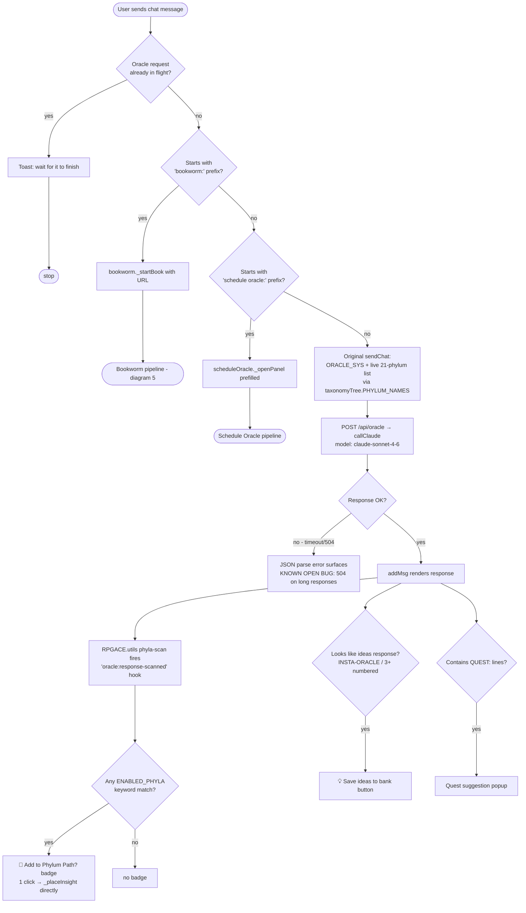
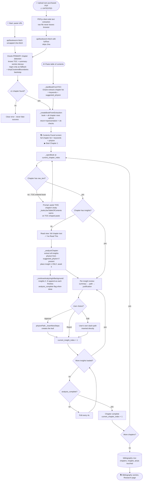
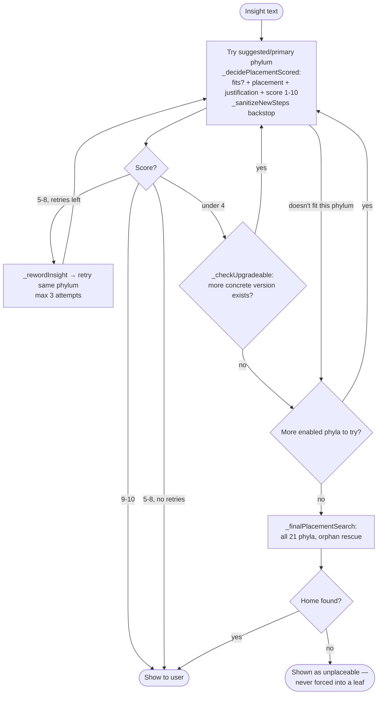
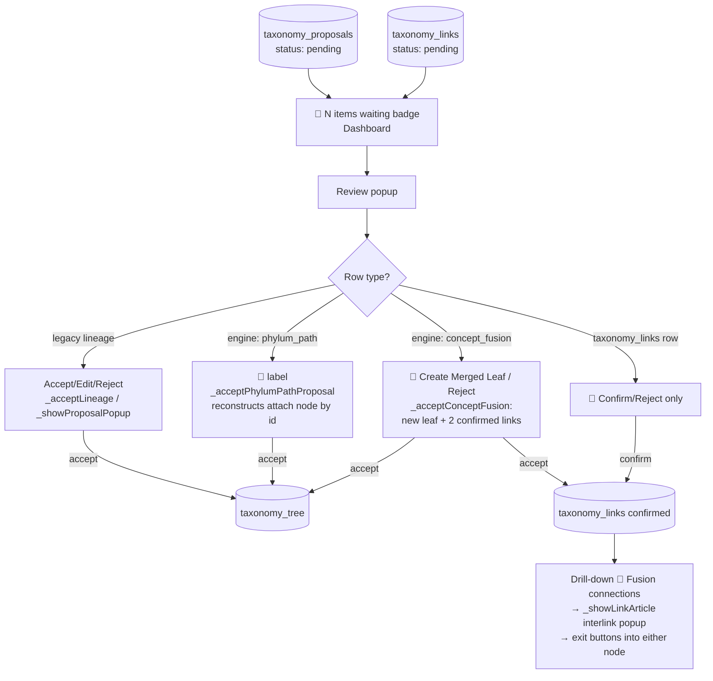
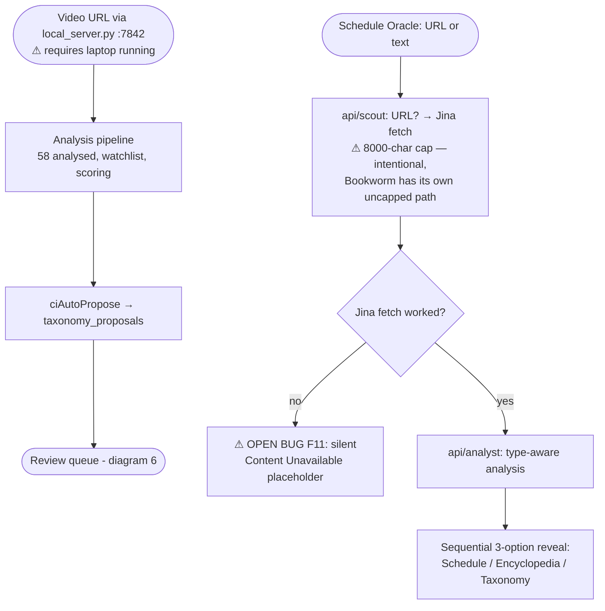
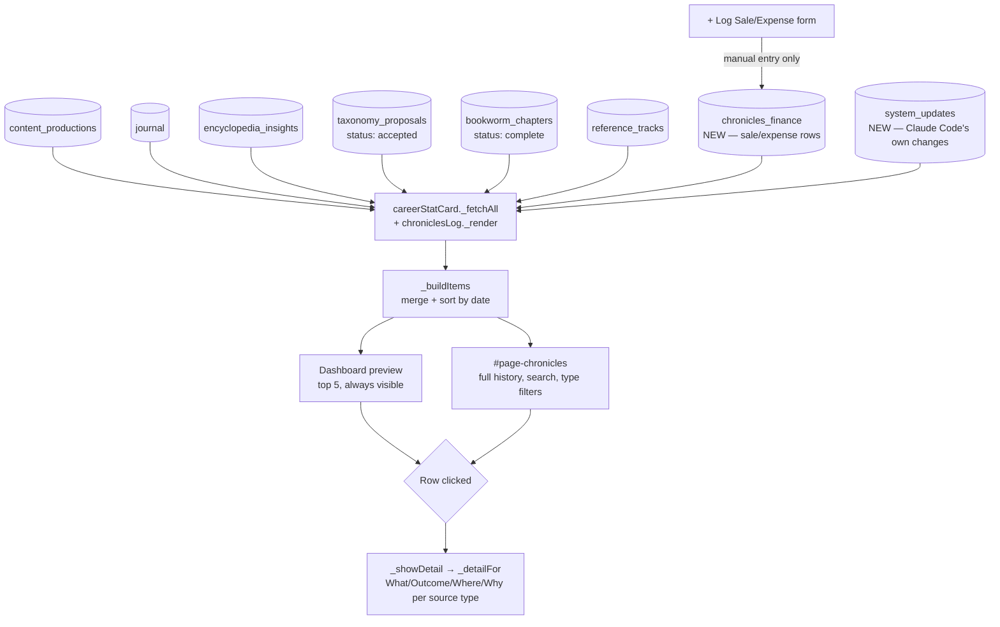
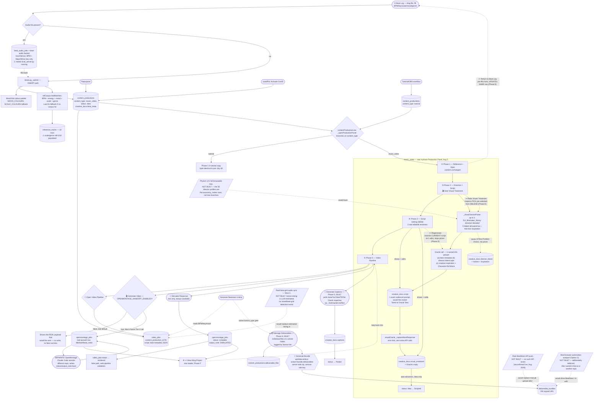
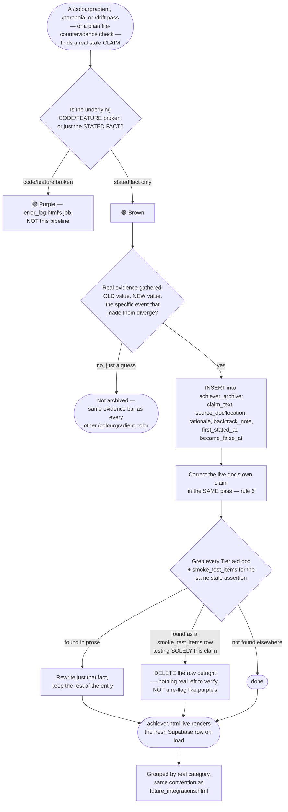

# RPGACE — System Flow Map
**The 5th Oversight doc.** Created July 17, 2026 from a full audit of all oversight files + the live codebase (`main.js`, `rpgace_core.js`, `api/*`, `index.html`). **Last re-verified Aug 14, 2026** (real `/CEO`/`/Routine` execution on the "Galaxy Map" plan's G15 prerequisite — §10 gained an Aug 14 truth-table block). Prior: Aug 13, 2026 (real `/CEO` execution on the "Galaxy Map" plan, G1-G3/G10/G12 — §10 gained an Aug 13 truth-table block). Prior: Aug 11, 2026 (real `/CEO`-framework A17 execution — §10 gained an Aug 11 truth-table block covering the massive-expansion critique doc build). Prior: Aug 6, 2026 (real `/paranoia`-shaped deduplication pass across all 5 non-CLAUDE.md oversight docs — GODMODE evidence confirmed this doc's truth table stopped at Aug 5's Phase-H block with zero mention of Aug 6's real shipped work; §10 gained an Aug 6 truth-table block. Full record: `oversight_doc_dedup_paranoia_2026-08-06.txt`). Prior re-verification: Aug 5, 2026 (Council of 5 + GODMODE/`/scope`/`/commit-archaeologist`-informed oversight sweep after Phases A-F of the Content/Video Pipeline unification — §11's diagram fully rebuilt). Before that: July 31, 2026 (module inventory re-grepped, table list rebuilt from `pg_policies`; record in `oversight_doc_audit_and_reshape_2026-07-31.txt`). This line gets bumped whenever a real re-verification pass runs, not just on creation. Diagrams are Mermaid — render on GitHub, in VS Code, or any Mermaid viewer. Every diagram follows the same convention: **rectangles = processing**, **diamonds = yes/no decisions**, **cylinders = data stores**, **stadiums = entry/exit points**, **dashed boxes = PLANNED, not built**.

Companion to CLAUDE.md (the operational guide). Update BOTH when architecture changes.

---

## 0. Verified Component Inventory

**The module count is a live fact, re-grepped from `rpgace_core.js`** (`grep -oP "RPGACE\.register\(\s*'\K[a-zA-Z0-9_]+"`, deduplicated) — see CLAUDE.md's own current Live-numbers line for the count rather than trusting a number restated here, since it moves independently of this doc and has gone stale more than once when trusted on its own. `myFeature` (SCHEDULE) is a real, oddly-named module — confirmed by reading its source, not a stray/test leftover.

### Domains and modules (from `rpgace_core.js` markers)

| Domain | Modules |
|---|---|
| ORACLE | youtubeOracle, tiktokOracle, prodOraclePanel, instaOraclePanel, quickActions, visualOracle, contentRepurpose, oracleAppGrounding, oracleDevBridge, oracleFetchGuard, oracleTreeGrounding, agentsIntoOracle, mockOracle, oracleProviderMode |
| LEARNING | feynman, encSync, ciAutoPropose, taxonomyReviewQueue, encTaxonomyLink, agendaReminder, scheduleOracle, intelDelete, taxonomySync, knowledgeGap, taxonomyTree, phylumPath, bookworm, encyclopediaQoL, intelBatchList, intelDedup, jargonEncyclopedia, researchTabs |
| CONFIG | config (defines `RPGACE.sb`, `RPGACE.cache`, `RPGACE.hooks`, CONFIG constants) |
| CONTENT | beatLog, refCorpus, contentProductionLive, videoPipeline, conidPot, videoSummary |
| JOURNAL | morningBrief, journalQoL |
| DASHBOARD / NAV | dashDeck, leftNav, pathRouter, chroniclesLog, careerStatCard, docsLinks, pwaInstall |
| SYSTEM | suppressQuestPopup, authGate, perfWatch, voiceInput, errorLog |
| SCHEDULE | shiftSync, myFeature, scheduleFixes |

Newer modules (`cookingOracle`, `shoppingWishlist`, `oracleControl`, and any shipped since) are tracked by CLAUDE.md's own Live-numbers line rather than backfilled into this table row-by-row — re-grep before treating this table as exhaustive.

### Serverless API (`api/`)
`oracle.js` (Claude proxy, accepts optional `model`, plus the dormant Kimi/Luna provider branch), `scout.js` (URL detect + Jina fetch, 8000-char cap), `analyst.js`, `bookworm-fetch.js` (uncapped fetch OR provided fullText → Oracle chapter detection), `composio.js`, `executor.js`, `orchestrate.js`, `data-write.js` (service-role write proxy + the `bundle-deliverables` action), `search.js`, `lastfm.js`, `auth.js` (server-side password check + shared-secret issuance, see §10's API-auth entry), `_context.js` (shared: `callClaude`, `MODEL='claude-sonnet-4-6'`, `MODEL_EXTRACTOR='claude-fable-5'`, `fetchURL`, `setCORS`, `requireAuth`, Composio `ACCOUNTS`/`TOOL_ALIASES` — the single source of truth for both).

### Supabase tables
**Tables are grouped by RLS posture below, because the posture is load-bearing** — re-query `pg_policies` directly for the current live table list and posture rather than trusting a fixed total here.

*Restricted (`anon_read_only` SELECT + `authenticated_all` — all writes must go through `/api/data-write`'s service-role proxy):* `taxonomy_tree` (recursive, parent_id/depth/path/phylum_number/node_type/explainer/deep_content/sources), `taxonomy_proposals` (staging + review, `proposed_steps.engine` tags: legacy / `phylum_path` / `concept_fusion`), `taxonomy_links` (symmetric fusion links + `link_article`), `taxonomy_nodes` (older flat store — still the home of the `f14_filmmaker_library`/`beatlog_scale_colours`/`f16_licence_terms` reference libraries), `taxonomy_decision_log`, `encyclopedia` (`taxonomy_node_id` links), `encyclopedia_insights`, `content_productions` (ConID + licence/price + `content_type` discriminator + `creative_docs` jsonb), `video_jobs` (F17 — `content_production_id` FK, `style_profile_id`, `edl`), `style_profiles` (Director Match output), `reference_tracks` (beat-matching corpus, +scale/genre/url), `conid_pot`, `bookworm_books`, `bookworm_chapters` (+keywords, suggested_phylum, analysis_complete), `bibliography`, `chronicles_finance`, `oracle_dev_suggestions`, `rpgace_agendas`, `oracle_module_anatomy` (Oracle-only per-module architecture/anatomy digest, curated by Claude Code sessions only; deliberately excluded from `api/data-write.js`'s `ALLOWED_TABLES` since nothing in the app writes to it client-side), `intel_reanalysis_pool` (Aug 27 2026 — real deleted intel reports/encyclopedia entries, backing the "delete doesn't stick" fix), `oracle_actions` (Aug 26 2026, G41 — the curated action vocabulary `oracleControl` dispatches against).

*Deliberately still `anon_all` because a real external writer needs the plain anon key — never sweep these into an RLS batch without giving that writer another path:* `journal` (Morning Brief Routine), `oracle_fallback_queue` (Fallback Drain Routine), `openmontage_jobs` (the separate OpenMontage Claude Code session), `beat_audio_jobs` (local librosa runner), `intel_jobs`/`intel_reports`/`intel_watchlist`/`intel_bibliography` (`local_server.py`, port 7842 — `intel_bibliography` is a real, unrelated table sharing a near-identical name with `bibliography`), `rpgace_shifts` (external Python browser-use script), `system_updates` (written by Claude Code sessions via MCP), `error_log`/`smoke_test_items`/`ceo_plan_items` (Sep 15 2026 — each has a real, confirmed live anon-key write from the deployed browser app; see CLAUDE.md's own landmine note).

*Views:* `book_knowledge`/`jargon_encyclopedia` (both `security_invoker`).

*Storage:* `beat-audio` bucket (Beat Log's librosa uploads, private, blanket `anon_all`); `beat-deliverables` bucket (real sellable beat deliverable files/stems/zips, private, anon INSERT/DELETE only — deliberately no anon SELECT, since raw bytes here are Alex's paid IP, not disposable analysis samples; reads only via the service-role key inside `api/data-write.js`'s `bundle-deliverables` action, or a signed URL it hands out).

#### Per-table purpose/constraint reference

*(Relocated verbatim from `manual.html`'s own "Supabase Tables" section, Sep 23 2026, Minotaur/Manual Unification M2 — manual.html retired, this is now the one authoritative per-table detail source; `ai_tooling_and_rules_map.md`'s own connector table cross-references here rather than duplicating. Content preserved as originally written; individual facts may predate later corrections logged elsewhere in this doc/CLAUDE.md — where the two disagree, the more recent, dated fact wins, per rule 1.)*

| Table | Purpose | Constraint |
|---|---|---|
| `encyclopedia` | Knowledge entries | UNIQUE(title) |
| `taxonomy_nodes` | Legacy flat gap scores | — |
| `taxonomy_tree` | Recursive lineage tree | Self-referencing parent_id |
| `taxonomy_proposals` | Staging for auto-proposals | Nothing live until accepted |
| `taxonomy_links` | Fusion links — cross-taxonomy connections, any rank/phylum | Symmetric node_a_id/node_b_id + link_insight; nothing live until confirmed |
| `taxonomy_tree` (all 21 phyla) | All 21 of 21 phyla enabled (`ENABLED_PHYLA:[1..21]`) — jargon-bucket leaves for most; Phylum 12 (Fons Educationis) rebuilt as a real 3-level deep hierarchy (6 Orders → 16 Classes → 16 leaves), the confirmed proof-of-concept for the rest. Real current phylum-number mapping (renumbered Aug 11): Fons Educationis=11, Lingua Musicae=12, Visio Cinematica=13, Contentum=14. | Fusion-link pass + hand-test for the 9 later-enabled phyla remain deferred until real Oracle/Claude API access is confirmed restored |
| `style_profiles` | Director Match / Visual Treatment output parsed out of a `DIRECTOR_CHOSEN:` response trailer, linked from `video_jobs.style_profile_id` | 3 real rows as of Aug 11 (corrected from an earlier "0 rows ever" claim) — the save path has fired successfully in production; every failure point still raises a real toast |
| `beat_audio_jobs` | Async job queue for local librosa audio analysis (BPM + Major/Minor key only) paired with a `beat-audio` Storage bucket | anon_all by design — the local runner holds only the anon key. Needs `local_server.py` running |
| `beat-deliverables` (Storage bucket, no table) | Real sellable beat deliverable files (stems/wav/zips) per ConID, tracked via `content_productions.deliverable_files`/`.deliverable_bundles` | Anon INSERT/DELETE only, no SELECT — raw file bytes can only be read via the service-role key inside `api/data-write.js`'s `bundle-deliverables` action, or a signed URL |
| `openmontage_jobs` | Async handoff queue between RPGACE's Oracle, this Claude Code session, and a *separate* OpenMontage Claude Code session in a different repo. Carries a title/brief/beat_meta job payload; the external session writes `status`/`output_note` back | anon_all by design and must stay that way — the external session has no service-role key and no shared secret |
| `oracle_fallback_queue` | Where a credit-exhaustion failure in a background AI job parks itself, drained hourly by a Claude Code Remote Routine that resumes the placement | anon_all by design (the Routine writes with the plain anon key). Never exercised against a real credit-exhaustion event |
| `content_productions` | ConID tracker — the real spine of the beat-to-posted-video journey, written by three creation paths (Repurpose, Activate ConID, Beat Log) | Has a `content_type` discriminator (`tutorial` \| `music_video`), a `creative_docs` jsonb (script/director_blend/captions keys), an `updated_at` column, and `deliverable_files`/`deliverable_bundles` columns |
| `conid_pot` | Idea bank | — |
| `reference_tracks` | Artist-matching corpus for Beat Log's "find artists" step | 32 rows. `scale`/`genre`/`url` columns exist and `findMatches()` scores them, but scale/genre are still 0/32 populated — the real root cause of "beat matches are always the same"; the backfill popup requires Alex's own per-track judgment call, not an automated guess (confirmed Sep 23 2026) |
| `video_jobs` | Beat log entries + the granular file-path sub-tracker under `content_productions` | `content_production_id` FK has no cascade — ConID delete handles it explicitly. `edl` and `style_profile_id` wired |
| `rpgace_shifts` | Rota, auto-synced | UNIQUE(date, start) |
| `rpgace_agendas` | Scheduled tasks, cross-device | — |
| `intel_jobs` / `intel_reports` | Content Intelligence pipeline | — |
| `intel_reanalysis_pool` | Real deleted intel reports/encyclopedia entries logged here (url/title/source_table/deleted_row_created_at/status), backing the shared suppression check that stops `local_server.py`'s own stale copy from resurfacing a deleted extraction while leaving the same URL free for a genuinely newer reanalysis. Also renders as Encyclopedia's own "🔁 Re-analysis Pool" browsable list | RLS enabled, anon_read_only + authenticated_all (writes route through `api/data-write.js`) |
| `intel_bibliography` | Source citations | Feeds future taxonomy footnotes |
| `oracle_dev_suggestions` | Oracle's suggestions flagged for a future Claude Code session (id/created_at/suggestion_text/category/status/source) | RLS enabled, restricted |
| `taxonomy_decision_log` | Append-only audit trail of every taxonomy commit (phylum_number/node_id/path/insight_text/source), written at `phylumPath._insertNewSteps`'s single choke point | RLS enabled, restricted |
| `chronicles_finance` | Real sale/expense rows (entry_date/type/category/item/amount/notes) for The Chronicles' personal-visibility finance ledger | RLS enabled, restricted |
| `system_updates` | Every real Claude Code change to RPGACE (title/summary/category), so Chronicles shows dev-side activity alongside Alex's own | RLS enabled, anon_all (Claude Code sessions write via MCP) |
| `oracle_actions` | The real, live-editable action vocabulary Oracle Control recognizes phrases against (action_id/trigger_phrases/target/data_touched/explanation fields/confirm_required). 5 rows have a real coded execution branch as of Sep 22 2026 (F0/F15): `log_beat`, `new_quests`, `draft_email`, `yt_stats`, `log_notion` — all 4 real "quickPrompt" dashboard buttons plus the Agents-page quick-actions bar dispatch through this same confirm-before-execute mechanism. A row can also arrive from Oracle's own `ORACLE_SUGGEST_ACTION:` suggestion, only once Alex approves it | RLS enabled, restricted |
| `book_knowledge` *(view)* | Real, structured, queryable book-derived knowledge: unnests `bookworm_chapters.insights` (approved only), joined with `bookworm_books` for title. Zero new writes | security_invoker view over existing RLS/permissions |
| `jargon_encyclopedia` *(view)* | Read-only glossary over real leaf-level taxonomy_tree rows (`node_type='leaf' AND status='accepted'`). Same live-query-every-load convention as `taxonomy_map.html` | security_invoker view over existing RLS/permissions |
| `recipes` / `ingredients` / `recipe_ingredients` / `ingredient_prices` (+ 4 cost/staleness/frequency views) | The real HABITS/Cooking schema (H1-H9). Ingredient price history is plain inserts, never updates (append-only) | anon_read_only + authenticated_all from creation |
| `habits_config` / `planned_cooks` / `pantry_stock` / `shopping_lists` / `shopping_list_items` | `planned_cooks` gained a real draft lifecycle Sep 16 (H12); `pantry_stock`'s PK is `(ingredient_id, location)` across Pantry/Fridge/Freezer; `shopping_list_items` gained a real `in_basket` column Sep 17 (H22) | anon_read_only + authenticated_all from creation |
| `ingredient_aliases` / `ingredient_substitution_confirmations` / `substitution_ratings` | H24, Sep 17 2026 — a permanent "declare same item" merge table; a real persistent confirm record per (ingredient, substitute) pair; an append-only post-cook substitution rating log | anon_read_only + authenticated_all from creation |
| `kitchen_equipment` | H11, Sep 16 2026 — a real owned-equipment inventory, distinct from `habits_config`'s oven/stovetop capacity and `wishlist_items`'s planned-purchase tracking | anon_read_only + authenticated_all from creation |
| `cofid_foods` | Asian ingredients/nutrition — 7,743 rows across 6 sources (UK CoFID, India IFCT, China CFCT, Japan MEXT, SE-Asia ASEAN FCD), cross-source deduped. Korea is the one remaining real gap | anon_read_only + authenticated_all from creation |
| `wishlist_items` / `wishlist_config` | Sep 14 2026 — the standalone Shopping Wishlist module's own tables, deliberately separate from HABITS' ingredient-specific shopping list. `wishlist_config` is a real single-row (`id=1`) settings table holding `budget_target` | anon_read_only + authenticated_all from creation |

### The two real hubs (confirmed in interconnection_map.md)
Everything converges on **Oracle** (`callOracle`/`sendChat`/`api/oracle.js`) and the **Taxonomy Tree** (`taxonomy_tree` + its propose/review cycle) — except SCHEDULE, which runs fully independent.

---

## 1. Top-Level System Map

```mermaid
flowchart TD
    subgraph INPUTS[Input Surfaces]
        CHAT([Oracle chat])
        PANELS([Oracle panels: Prod/Insta/YouTube/Visual])
        CI([Content Intelligence video URL])
        SCHED([Schedule Oracle: URL/text])
        BW([Bookworm: URL / TOC paste / PDF upload])
        MANUAL([Manual: Beat Log, ConID, shifts, agendas])
        HIGHLIGHT([Text-select highlight])
    end

    subgraph PROCESS[Processing Core]
        ORACLE[callOracle / api/oracle.js<br/>+ extractor/ground-worker 2-tier for Phylum Path]
        SCAN[Shared phyla-scan<br/>oracle:response-scanned hook]
        PLACE[phylumPath.decidePlacement<br/>5-check reasoning]
        REVIEW[taxonomyReviewQueue<br/>3 card types + fusion links]
    end

    subgraph STORES[(Data)]
        TREE[(taxonomy_tree)]
        PROPS[(taxonomy_proposals)]
        LINKS[(taxonomy_links)]
        ENC[(encyclopedia)]
        CONID[(content_productions)]
        BOOKS[(bookworm_books/chapters)]
        BIB[(bibliography)]
    end

    subgraph OUTPUTS[Output Surfaces]
        DRILL([Phylum Path nav-tab drill-down])
        DASH([Dashboard widgets])
        ENCPG([Encyclopedia page])
        TAXMAP([taxonomy_map.html - live query])
    end

    CHAT --> ORACLE
    PANELS --> ORACLE
    HIGHLIGHT --> PLACE
    CI --> SCAN
    SCHED --> ORACLE
    BW --> PLACE
    ORACLE --> SCAN
    SCAN -->|badge clicked| PLACE
    PLACE -->|confirmed| TREE
    PLACE -->|staged| PROPS
    PROPS --> REVIEW
    REVIEW -->|accept| TREE
    REVIEW -->|accept fusion| LINKS
    TREE --> DRILL
    TREE --> TAXMAP
    ORACLE -->|articles| ENC
    ENC --> ENCPG
    MANUAL --> CONID
    BW --> BOOKS
    BOOKS -->|book complete| BIB
    LINKS --> DRILL
    CONID --> DASH
    BOOKS --> DASH
```

---

## 2. Oracle Chat Request Flow (`main.js sendChat` + wraps)

```mermaid
flowchart TD
    START([User sends chat message]) --> INFLIGHT{Oracle request<br/>already in flight?}
    INFLIGHT -->|yes| BLOCK[Toast: wait for it to finish] --> END1([stop])
    INFLIGHT -->|no| BWTRIG{Starts with<br/>'bookworm:' prefix?}
    BWTRIG -->|yes| BWSTART[bookworm._startBook with URL] --> END2([Bookworm pipeline - diagram 5])
    BWTRIG -->|no| SCHTRIG{Starts with<br/>'schedule oracle:' prefix?}
    SCHTRIG -->|yes| SCHPANEL[scheduleOracle._openPanel prefilled] --> END3([Schedule Oracle pipeline])
    SCHTRIG -->|no| SEND[Original sendChat:<br/>ORACLE_SYS + live 21-phylum list<br/>via taxonomyTree.PHYLUM_NAMES]
    SEND --> API[POST /api/oracle → callClaude<br/>model: claude-sonnet-4-6]
    API --> OK{Response OK?}
    OK -->|no - timeout/504| ERR[JSON parse error surfaces<br/>KNOWN OPEN BUG: 504 on long responses]
    OK -->|yes| RENDER[addMsg renders response]
    RENDER --> SCAN[RPGACE.utils phyla-scan fires<br/>'oracle:response-scanned' hook]
    SCAN --> MATCH{Any ENABLED_PHYLA<br/>keyword match?}
    MATCH -->|yes| BADGE[🧬 Add to Phylum Path? badge<br/>1 click → _placeInsight directly]
    MATCH -->|no| NOBADGE[no badge]
    RENDER --> IDEAS{Looks like ideas response?<br/>INSTA-ORACLE / 3+ numbered}
    IDEAS -->|yes| SAVEBTN[💡 Save ideas to bank button]
    RENDER --> QUEST{Contains QUEST: lines?}
    QUEST -->|yes| QPOPUP[Quest suggestion popup]
```

---

## 3. Phylum Path Insight Placement (the core taxonomy write path)

```mermaid
flowchart TD
    E1([Manual panel: Place this insight]) --> DP
    E2([Auto-detect badge click]) --> DP
    E3([Highlight → Send to Phylum Path]) --> PANEL[Panel opens prefilled] --> DP
    E4([proposeLineage/silentPropose<br/>ALL phyla — old flat prompt DELETED July 19]) --> DP
    E5([Bookworm approve — diagram 5]) --> INS

    DP[decidePlacementScored — THE unified engine, July 19:<br/>1. fetch phylum's full tree fresh<br/>2. ONE ground-worker call: fits? + 5 checks +<br/>hard rules from the tree audit + justification + score 1-10<br/>3. sanitizePlacement mechanical guard] --> DECIDE
    DECIDE[Result: fits + attachNode + newSteps +<br/>explainers + justification + confidence] --> CONFIRM[_showPlacementConfirm popup<br/>editable steps, insert/delete rows]
    CONFIRM --> USER{User choice?}
    USER -->|Reject| STOP([nothing written])
    USER -->|Accept| INS[_insertNewSteps:<br/>sanitizePlacement re-run at choke point<br/>depth cap 6 — catches raw Edit-box input too<br/>chained inserts, return=representation,<br/>parent_id linked correctly]
    INS --> TREE[(taxonomy_tree)]
    INS --> CONTENT[_generateInsightContent<br/>3-layer teaching → deep_content]
    INS --> FUSION[_findFusionLinks fire-and-forget:<br/>scan ENTIRE tree all phyla]
    FUSION --> FOUND{Genuine combine-into-<br/>technique connection?}
    FOUND -->|yes 0-3| PENDING[(taxonomy_links<br/>status: pending)]
    FOUND -->|no| DONE([done])
    PENDING --> RQ([Review queue - diagram 6])
```

---

## 4. Article Generation + Concept Fusion

```mermaid
flowchart TD
    BTN([Generate/Refresh Article button<br/>side panel or drill-down, any rank]) --> CACHED{Encyclopedia row exists<br/>for this taxonomy_node_id?}
    CACHED -->|yes| SHOW[Show cached article + Refresh button]
    CACHED -->|no| GEN
    SHOW -->|Refresh clicked| GEN
    GEN[_generateArticleText:<br/>gather node + all descendants' content<br/>→ extractor outline → ground-worker writes] --> POPUP[_showArticleConfirm popup<br/>full text shown]
    POPUP --> CHOICE{User choice?}
    CHOICE -->|Discard| X([nothing saved])
    CHOICE -->|Save| SAVE[saveOracleToEncyclopedia<br/>+ taxonomy_node_id link]
    SAVE --> ENC[(encyclopedia)]
    SAVE --> CF{Node is a branch?<br/>Order/Class/Family/Genus}
    CF -->|no - leaf| DONE([done])
    CF -->|yes| CFRUN[_findConceptFusion fire-and-forget:<br/>all OTHER phyla's branches as candidates]
    CFRUN --> CFFOUND{Distant branch merges into<br/>genuinely NEW teachable idea?}
    CFFOUND -->|no| DONE
    CFFOUND -->|yes| STAGE[(taxonomy_proposals<br/>engine: concept_fusion)]
    STAGE --> RQ([Review queue - diagram 6])
```

---

## 5. Bookworm (whole-book → taxonomy pipeline)

```mermaid
flowchart TD
    U1([📖 Start: paste URL]) --> FETCH[api/bookworm-fetch:<br/>uncapped Jina fetch]
    U2([✍️ Paste table of contents]) --> TOC[_startBookFromTOC:<br/>Oracle extracts chapter list<br/>+ keywords + suggested_phylum]
    U3([📎 Upload own purchased PDF<br/>⚠ UNTESTED]) --> PDFX[PDF.js client-side text extraction<br/>raw file never leaves browser] --> FETCH2[api/bookworm-fetch with fullText<br/>skips Jina]
    FETCH --> DETECT
    FETCH2 --> DETECT
    DETECT[Oracle-PRIMARY chapter detection<br/>knows TOC + summary-section decoys<br/>regex only as fallback<br/>+ dropClusteredBoundaries backstop] --> DOK{≥1 chapter found?}
    DOK -->|no| ERRX[Clear error - never fake success]
    DOK -->|yes| CREATE[_createBookFromExtraction:<br/>book + all chapter rows upfront<br/>return=representation + ok-checks]
    TOC --> CREATE
    CREATE --> FOUND[📚 Contents Found screen:<br/>full chapter list + keywords + phylum<br/>▶ Start Chapter 1]
    FOUND --> OPEN[_openBook at current_chapter_index]
    OPEN --> HASTEXT{Chapter has raw_text?}
    HASTEXT -->|no - TOC-entered book| ADDTEXT[Prompt: paste THIS chapter's body<br/>_looksLikeTableOfContents warns<br/>on TOC-shaped paste] --> OPEN
    HASTEXT -->|yes| HASINS{Chapter has insights?}
    HASINS -->|no| READ[Read view: full chapter text<br/>✓ I've Read This]
    READ --> ANALYZE[_analyzeChapter:<br/>extract all insights<br/>phylum from suggested_phylum if present<br/>place insight 1 ONLY, await it]
    ANALYZE --> BG[_continueAnalyzingInBackground:<br/>insights 2..N append as each finishes<br/>analysis_complete flag when done]
    ANALYZE --> RVW
    HASINS -->|yes| RVW[Per-insight review:<br/>summary → path → justification]
    RVW --> DEC{User choice?}
    DEC -->|Approve| LEAF[phylumPath._insertNewSteps<br/>creates the leaf] --> NEXT
    DEC -->|Reject| NEXT[current_insight_index + 1]
    DEC -->|Edit| OWN[User's own slash-path<br/>inserted directly] --> NEXT
    NEXT --> MORE{More insights loaded?}
    MORE -->|yes| RVW
    MORE -->|no| DONEANLZ{analysis_complete?}
    DONEANLZ -->|no| WAIT[Poll every 4s] --> MORE
    DONEANLZ -->|yes| CHDONE[Chapter complete<br/>current_chapter_index + 1]
    CHDONE --> LASTCH{More chapters?}
    LASTCH -->|yes| OPEN
    LASTCH -->|no| BIB[(bibliography row:<br/>chapters, insights, phyla touched)]
    BIB --> RESEARCH([📚 Bibliography section, Research page])
```

**Insight placement cascade inside `_analyzeChapter`** (per insight):

```mermaid
flowchart TD
    I([Insight text]) --> P1[Try suggested/primary phylum<br/>_decidePlacementScored:<br/>fits? + placement + justification + score 1-10<br/>_sanitizeNewSteps backstop]
    P1 --> S{Score?}
    S -->|9-10| SHOW([Show to user])
    S -->|5-8, retries left| RW[_rewordInsight → retry same phylum<br/>max 3 attempts] --> P1
    S -->|under 4| UP{_checkUpgradeable:<br/>more concrete version exists?}
    UP -->|yes| P1
    UP -->|no| NEXTPH{More enabled phyla to try?}
    S -->|5-8, no retries| SHOW
    P1 -->|doesn't fit this phylum| NEXTPH
    NEXTPH -->|yes| P1
    NEXTPH -->|no| BROAD[_finalPlacementSearch:<br/>all 21 phyla, orphan rescue]
    BROAD --> BF{Home found?}
    BF -->|yes| SHOW
    BF -->|no| UNPL([Shown as unplaceable —<br/>never forced into a leaf])
```

---

## 6. Review Queue (Dashboard — all pending taxonomy decisions)

```mermaid
flowchart TD
    SRC1[(taxonomy_proposals<br/>status: pending)] --> BADGE[🌳 N items waiting badge<br/>Dashboard]
    SRC2[(taxonomy_links<br/>status: pending)] --> BADGE
    BADGE --> QUEUE[Review popup]
    QUEUE --> TYPE{Row type?}
    TYPE -->|legacy lineage| L[Accept/Edit/Reject<br/>_acceptLineage / _showProposalPopup]
    TYPE -->|engine: phylum_path| PP[🧬 label<br/>_acceptPhylumPathProposal<br/>reconstructs attach node by id]
    TYPE -->|engine: concept_fusion| CFC[🌌 Create Merged Leaf / Reject<br/>_acceptConceptFusion:<br/>new leaf + 2 confirmed links]
    TYPE -->|taxonomy_links row| FL[🔗 Confirm/Reject only]
    L -->|accept| TREE[(taxonomy_tree)]
    PP -->|accept| TREE
    CFC -->|accept| TREE
    CFC -->|accept| LINKS[(taxonomy_links confirmed)]
    FL -->|confirm| LINKS
    LINKS --> DRILL[Drill-down 🔗 Fusion connections<br/>→ _showLinkArticle interlink popup<br/>→ exit buttons into either node]
```

---

## 7. Content Intelligence & Schedule Oracle ingestion

```mermaid
flowchart TD
    CIURL([Video URL via local_server.py :7842<br/>⚠ requires laptop running]) --> CIA[Analysis pipeline<br/>58 analysed, watchlist, scoring]
    CIA --> CIPROP[ciAutoPropose → taxonomy_proposals]
    CIPROP --> RQ([Review queue - diagram 6])

    SO([Schedule Oracle: URL or text]) --> SCOUT[api/scout: URL? → Jina fetch<br/>⚠ 8000-char cap — intentional,<br/>Bookworm has its own uncapped path]
    SCOUT --> JOK{Jina fetch worked?}
    JOK -->|no| SILENT[⚠ OPEN BUG F11: silent<br/>Content Unavailable placeholder]
    JOK -->|yes| ANALYST[api/analyst: type-aware analysis]
    ANALYST --> THREE[Sequential 3-option reveal:<br/>Schedule / Encyclopedia / Taxonomy]
```

---

## 8. PLANNED features (dashed = not built) and where they attach

```mermaid
flowchart TD
    subgraph BUILT[Built today]
        BWPIPE[Bookworm pipeline]
        RVW[Per-insight review popups]
        TREE[(taxonomy_tree)]
        DP[decidePlacement]
        BK[(book_knowledge view<br/>July 22)]
        JE[(jargon_encyclopedia view<br/>July 22)]
        FALLBACK[Claude Code fallback lane<br/>built July 24 — real, unexercised<br/>see claude_fallback_build_plan_2026-07-24.txt]
        FBQ[(oracle_fallback_queue<br/>real table, created July 24)]
        MB2[RPGACE Fallback Drain Routine<br/>trig_01QxebLsiPMVksNSVjNECdbD, hourly]
    end

    subgraph PLANNED[Planned — attach points shown]
        CARDS[/"Live-study card list UI<br/>ConID-card pattern: per-chapter cards,<br/>edit title, status, context action.<br/>REPLACES the modal-per-step flow,<br/>calls the SAME _openBook/_renderInsightReview logic"/]
        DEBATE[/"/debate skill run on a real topic:<br/>Claude's general knowledge vs.<br/>a specific gathered tree insight —<br/>comparison only, never auto-writes"/]
        F12[/"Schedule Oracle Phase 2:<br/>carousel, two-tier session memory, auto-routing"/]
        PHYLA11[/"The REMAINING phyla through the<br/>7-step Development Framework:<br/>12, 13, 15-21. Phyla 11 + 14 cleared it<br/>July 30 and are live in ENABLED_PHYLA"/]
        EPUB[/"EPUB/other-format upload<br/>same _createBookFromExtraction path<br/>as PDF upload"/]
    end

    CARDS -.->|renders| BWPIPE
    CARDS -.->|reuses| RVW
    DP -.->|already shared by book + non-book, July 19| BWPIPE
    BK -.->|unnests, read-only| BWPIPE
    JE -.->|selects leaves, read-only| TREE
    DEBATE -.->|compares against, never writes| TREE
    PHYLA11 -.->|extends ENABLED_PHYLA| DP
    EPUB -.->|new entry point| BWPIPE
    F12 -.->|extends| SO2[Schedule Oracle]
    FALLBACK -->|catches credit-exhaustion errors from| GW[the 3 shared ground-worker functions<br/>_callExtractor/_callGroundWorkerJSON/_callGroundWorkerText]
    FALLBACK -->|queues into| FBQ
    FBQ -->|drained by| MB2
    MB2 -->|resumes via bookworm._resumeFromFallback /<br/>taxonomyTree._resumeSilentProposeFromFallback| BWPIPE
```

**Real, standing correction**: the "Taxonomy Sorting Agent" and "Claude general-knowledge audit" nodes do not appear in the PLANNED subgraph above — tracing the real call chain shows `decidePlacement` is already the one shared engine for book and non-book inputs (no separate agent is needed), and the general-knowledge audit is built around `/debate` (comparison only, gated behind an explicit human decision to ever write anything) rather than the original 3-part tree-seeding design. `book_knowledge` and `jargon_encyclopedia` — what the Sorting Agent was originally described as blocking — are both shipped, read-only Postgres views over data already written by the existing pipeline above.

**July 24 — Claude Code fallback lane, judged, confirmed, and built the same session.** Judged first via `/debate`+Council-of-5+`/5thDimension` (`openmontage_and_claude_fallback_spec_backlog_2026-07-24.txt`), then a real evidence pass + a second `/debate` on scope (`claude_fallback_build_plan_2026-07-24.txt`) before any code was written. Scoped honestly as an async/batch fallback for background AI jobs only (Bookworm chapter analysis fully wired; Content Intelligence's silent taxonomy proposals fully wired; both reuse the same 3 shared ground-worker functions per rule 3) — never a live-chat replacement, since Claude Code Remote's `create_trigger` has a real hourly-minimum interval. Reuses River IX's own already-built mechanism (a Routine reading a Supabase reservoir on its own clock, same shape as the real Morning Brief Routine) rather than inventing a new one. Moved from PLANNED to BUILT because the table, the code, and the Routine all now genuinely exist — moved here rather than left dashed, but honestly flagged as **not yet exercised against a real credit-exhaustion event** (forcing one on purpose would mean actually draining Alex's own Anthropic credits). A real pre-existing bug was found and fixed in the same pass: none of the 3 shared ground-worker functions ever checked for an API error before this — one of them (`_callGroundWorkerText`) used to silently return an empty string on ANY failure. OpenMontage, judged the same session, does NOT appear anywhere in this diagram — its verdict was adopt as a fully separate operated tool, never an RPGACE-embedded flow, so it has no attach point here at all.

---

## 9. The Chronicles (activity-log aggregation + finance ledger)

```mermaid
flowchart TD
    T1[(content_productions)] --> AGG[careerStatCard._fetchAll<br/>+ chroniclesLog._render]
    T2[(journal)] --> AGG
    T3[(encyclopedia_insights)] --> AGG
    T4[(taxonomy_proposals<br/>status: accepted)] --> AGG
    T5[(bookworm_chapters<br/>status: complete)] --> AGG
    T6[(reference_tracks)] --> AGG
    T7[(chronicles_finance<br/>NEW — sale/expense rows)] --> AGG
    T8[(system_updates<br/>NEW — Claude Code's own changes)] --> AGG
    AGG --> BUILD[_buildItems<br/>merge + sort by date]
    BUILD --> DASH[Dashboard preview<br/>top 5, always visible]
    BUILD --> LOG[#page-chronicles<br/>full history, search, type filters]
    DASH --> CLICK{Row clicked}
    LOG --> CLICK
    CLICK --> DETAIL[_showDetail → _detailFor<br/>What/Outcome/Where/Why per source type]
    FORM[+ Log Sale/Expense form] -->|manual entry only| T7
```

Real design choice, not an oversight: `chronicles_finance` feeds Chronicles' display but is deliberately **excluded** from the career-score XP/Level formula computed in the same `_fetchAll` pass — confirmed via interrogation this is a separate visibility lane. `bookworm_chapters` feeds the cumulative Growth *count* but is excluded from the streak/recent-activity date logic (its `created_at` is a bulk-insert timestamp from TOC detection, not real per-chapter completion time — would show a misleading date otherwise).

---

## 10. Built vs NOT built — the truth table

### Built AND verified working (hand-tested or confirmed live)
**This section's own original July 18-31 snapshot (phyla count, fusion-link/taxonomy row counts, Bookworm's first hand-tested chapter) is archived verbatim in `CLAUDE_archive.md`** — every number in it is stale relative to CLAUDE.md's own current Live-numbers line (all 21 of 21 phyla enabled; live `taxonomy_tree`/`taxonomy_links`/`taxonomy_proposals` row counts) and to `smoke_test.html`'s own current hand-test tally, both of which supersede it as the authoritative current source.
- Phylum Path, Concept Fusion, the taxonomy review queue with all 3 proposal types + fusion-link cards, Bookworm's streaming analysis + checkpoint/resume + placement-path sanitizer, TOC-paste and PDF-upload chapter detection, Grounded Oracle (no invented phyla) with a request cross-wiring guard, and Content Intelligence end-to-end (plus cross-device sync for shifts/agendas) are all real, shipped, and code-verified.
- Current per-feature hand-test confirmation status lives in `smoke_test.html`, not here; the original hand-test rounds and root-cause debugging arcs (including Bookworm's longest debugging arc, PDF-upload chapter detection) live in `patch_notes.html`'s own dated cards, cited from the archived version of this section.

### Built but NEVER verified — treat as unconfirmed, test before building on
**This section predates HABITS, the Galaxy Map's G13-G117 build-out, and everything shipped after this doc's own last full re-verification — treat it as a real historical record of what was known-unverified at each build's own time, not a live status feed.** For CURRENT hand-test status on any given feature, `smoke_test.html`'s own Supabase-backed, Alex-hand-confirmed tally is the authoritative source (see CLAUDE.md's "Hand-testing" open fork — 27 of 99 rows confirmed as of Aug 30, 70 still unverified). Full build narrative for everything below lives in `patch_notes.html`'s own dated cards — every one of these items already cites it there, this section never re-tells the story.

- **Bookworm**: no book has ever completed the full pipeline start to finish (structure detection is solid on both entry points; a clean chapter run through the post-retune engine is the real remaining open test). `_looksLikeTableOfContents()`'s warning heuristic has never been observed catching a real mistake. Bibliography section render has nothing to show until a book completes.
- **F16 Beatstars listing / F17 video pipeline stages / F18 auto visual treatment / highlight-to-Phylum-Path button** — real, shipped, hand-test status tracked in `smoke_test.html` (also named in CLAUDE.md's own "F16/F17/F18 hand-test sweep" open fork).
- **The real July 20-25 build cluster** — left slide-out nav drawer, the Research Lab tab-content fix (superseded: Research Lab is now fully retired, not just fixed), the dashboard command deck rebuild, `book_knowledge`/`jargon_encyclopedia` views, the `/debate` skill, n8n rota sync (F10), Oracle self-awareness + the Claude Code bridge (`oracleAppGrounding`/`oracleFetchGuard`/`oracleDevBridge`/`taxonomy_decision_log`), a real nav-lag root-cause fix, PWA installability, the Career stat card + Chronicles rebuild, the `/scope` skill + `system_updates` table, `/5thDimension`, server-side API auth (now live and independently verified, see CLAUDE.md's Security note), a real Composio account-id dedup fix, Chronicles card-only + real pushState URLs + swipeable nav + `perfWatch`, every boot-time UI injector moving onto `RPGACE.registerBootTask`, and Approach B's write-proxy (now independently confirmed live via 8 real authenticated writes) — all real, all shipped.
- **The real July 26 - Aug 14 build cluster** — Oracle 504 streaming fix, the `renderMarkdown()` XSS fix, undersized-text fixes, `videoPipeline`/`morningBrief` dashDeck migrations, the Content Pipeline overseer (`style_profiles` now holds 3 real rows, see CLAUDE.md's Video/content pipeline section), the beat-matching root-cause fix (`reference_tracks.scale`/`genre` still 0/32 populated — the backfill popup exists, hasn't been run), local librosa audio analysis, voice input (since retired Aug 30, see CLAUDE.md), popup scaffolding consolidation, Phylum 11+14 built out (since superseded — all 21 phyla are now enabled, see CLAUDE.md's Taxonomy section), Video Pipeline Slice A, the `content_type` discriminator, the Video/Content Pipeline UX pass, the director picker + reply-truncation fix, `openmontage_jobs`' first real round-trip, the OpenMontage free-GPU investigation (since paused, superseded by a paid-provider search, see CLAUDE.md), Oracle architecture/anatomy grounding, the full Aug 5 8-phase Content/Video Pipeline unification (A-H), the Aug 6 bugfix/dev-tooling block, the Aug 11 `/CEO`-framework block, the Aug 11/12 minification + Grounded-Mode block, the Aug 13 Galaxy Map G1-G15 block, and the Aug 14 main.js/hooks detection-extension block — all real, all shipped, code-verified and live on `main`.

### Claimed/discussed but NOT built — do not trust any doc that implies otherwise
- Live-study **card-list UI** (ConID-card pattern for Bookworm chapters) — explicitly deferred
- Schedule Oracle Phase 2 (F12); Circles rabbit-hole nav (folded into Phase-2 vision); dedicated case-study/reference-tracks phylum; framework passes for the **remaining** phyla — see CLAUDE.md's Taxonomy section for the current, correct phylum-number mapping and which phyla still need the deep-hierarchy treatment
- ~~`hooks.on('rpgace:ready')` ~25-site audit~~ — **closed.** A real re-audit found the sites had already been fixed incidentally over time; a fresh grep confirms exactly **one** occurrence remains in `rpgace_core.js`, and it is `RPGACE.register()`'s own canonical module-init machinery — not a bug site. The underlying `hooks.fire()` behaviour (never revisits listeners added mid-fire) is still true and still worth knowing; there is no backlog attached to it.
- **Cut-precise beat-synced video generation** — genuinely not built and not close. The EDL/storyboard's scene timing is LLM-estimated; no beat-grid or onset detection exists anywhere in the stack. "In sync with the beat" today means mood/palette-matched. Real audio beat-grid sync is confirmed as a wanted future build (Slice C), unstarted.
- **Phylum 13's full browsable taxonomy tree** — the 50 real director profiles live in the flat `taxonomy_nodes` reference table (`source='f14_filmmaker_library'`), not as tree branches — see CLAUDE.md's Taxonomy section for the current phylum number.
- **Phylum XP Ledger** — spec'd (`phylum_xp_ledger_spec_backlog_2026-07-28.txt`), still not built. `questEngine` closed the real persistence gap this item used to cite (see CLAUDE.md's own superseding correction) — the real remaining open part is a dedicated phylum-tag architecture decision only Alex can settle.
- ~~Taxonomy Sorting Agent; Claude general-knowledge audit (3 parts)~~ — **resolved**, see the "Built but NEVER verified" section above (`book_knowledge`/`jargon_encyclopedia` views + the `/debate` skill).
- ~~Server-side API authentication; `CORRECT_PW` moved server-side~~ — **BUILT and live**, see CLAUDE.md's own Security note for the current, independently-verified state.
- ~~XSS/DOM-injection audit of `innerHTML` call sites~~ — **fixed**: `main.js`'s `renderMarkdown()` (behind every Oracle chat message) injected raw response text into `innerHTML` with zero escaping — fixed via a real `_escChatHtml()` step before the markdown regex chain runs. See CLAUDE.md.
- ~~Website performance audit~~ — a real static-code audit (file sizes, gzip sizes, load order, cache headers) plus the minification fix that followed from it are genuinely done. A live Lighthouse/PageSpeed run remains a confirmed-blocked path from this environment specifically (not transient — see CLAUDE.md's Known landmines).
- ~~RLS policy redesign~~ — **BUILT, confirmed end-to-end** — see "Built" above. 17 tables flipped from permissive `USING(true)` to real `anon_read_only`/`authenticated_all` policies, verified directly against `pg_policy`, then independently confirmed live via 8 real authenticated writes through the proxy.
- **Live-grounding for RLS/security status specifically** — deliberately not built (Supabase's advisor API isn't reachable from client-side browser JS; would need a dedicated server endpoint).
- ~~`system_flow_map.md` §0's own module inventory is stale~~ — **fixed**: §0's domain table is rebuilt from a real grep of every `RPGACE.register()` call, all modules listed by name and domain, not just counted — re-grep before trusting the count, it has gone stale more than once (see §0's own live-fact caveat).

### Known open bugs — see also §11
- ~~Oracle 504 on long responses~~ — **real fix built, confirmed live**: `api/oracle.js` proxies a genuine Anthropic SSE stream (opt-in via `stream:true`), `main.js`'s `callOracle()`/`sendChat()` consume it to progressively render the reply into the existing typing-indicator bubble, `maxDuration` raised to 300. A prior attempt shipped a client-only stub with no real server support and was reverted; that dead code (`RPGACE.streamOracle`/`restoreSendChat`) is deleted rather than left neutralised.
- F11 silent "Content Unavailable" on failed Jina fetches
- `_generateNodeContent` empty-deep_content mystery (partially resolved, never re-tested)

---

## 11. Content & Video Production Pipeline

**Why this section exists:** this pipeline has been real and load-bearing since July 28 and was never drawn anywhere in this document until July 31. **Rebuilt Aug 5** after a real `/interrogation`-scoped 8-phase unification (`content_video_pipeline_unification_spec_2026-08-05.txt`, Phases A-F shipped, G-H not started) merged Beat Log / Content Pipeline / Video Pipeline into one real, chronological, looping flow — the previous diagram (a 3-phase Production Panel with no real retroactive path) was already stale the moment Phase D shipped. Per this doc's own rule — a feature isn't "done" until it moves out of the dashed/planned section into a real diagram — drawn now from real code (`rpgace_core.js`'s `beatLog`/`contentProductionLive`/`visualOracle`/`videoPipeline` modules) and a live Supabase schema read, not from a doc's claim.

**How to read this diagram — one real chronological loop, not a static map**: information enters at Beat Log (top), gets processed and transported through exactly 4 real Production Panel phases in order, and — this is the "on loop" part Alex asked to make explicit — **3 of those 4 phases can hand control straight back to an earlier real step** to regenerate output without losing any prior data (the retroactive edit-in-place mechanism, Phase E). The loop only exits forward once Phase 4 hands off to OpenMontage and a real job result (or a safe simulated one) comes back.

```mermaid
flowchart TD
    BL(["① Beat Log — drag file, fill BPM/key/scale/mood/genre"]) --> AUD{Audio file present?}
    AUD -->|yes| LIBR[(beat_audio_jobs + beat-audio bucket<br/>local librosa: BPM + Major/Minor key only<br/>⚠ needs local_server.py running)]
    AUD -->|no| SUB
    LIBR -.->|fills back| SUB
    SUB[beatLog._submit — INSERT path] --> CP[(content_productions<br/>content_type: music_video, status: Idea<br/>creative_docs.beat_meta)]
    CP --> VJ[(video_jobs<br/>content_production_id FK<br/>script: beat metadata JSON)]
    SUB --> PALETTE[Mood-first colour palette<br/>MOOD_COLOURS, SCALE_COLOURS fallback]
    SUB --> MATCH[refCorpus.findMatches:<br/>BPM + energy + mood + scale + genre<br/>Last.fm fallback if no corpus hit]
    MATCH --> CORP[(reference_tracks — 32 rows<br/>⚠ scale/genre still 0/32 populated)]

    REP([Repurpose]) --> CP
    POT([conidPot: Activate ConID]) --> CP
    TUT([Tutorial/OBS workflow]) --> CPT[(content_productions<br/>content_type: tutorial)]

    CP --> PANEL{contentProductionLive<br/>_openProductionPanel<br/>branches on content_type}
    CPT --> PANEL
    PANEL -->|tutorial| P1[Phase 1-3 tutorial copy<br/>byte-identical to pre-July-30]
    PANEL -->|music_video| PH1

    subgraph MVPANEL["music_video — real 4-phase Production Panel, Aug 5"]
      direction TB
      PH1["② Phase 1 — Reference + Style<br/>content unchanged"]
      PH2["③ Phase 2 — Direction + Script<br/>🎬 Start Visual Treatment"]
      PH3["④ Phase 3 — Script Editing (NEW)<br/>2 real editable textareas"]
      PH4["⑤ Phase 4 — Video Pipeline"]
      PH1 --> PH2 --> PH3 --> PH4

      PH2 --> PICK[_showDirectorPicker:<br/>up to 3 f14_filmmaker_library directors blended<br/>5 helper phrases/row + free-text inspiration]
      PICK --> ORC["Oracle call — 3 named info groups:<br/>(a) beat metadata (b) director-blend style<br/>(c) creative inspiration + Character Ref Block"]
      ORC --> SAVE1[(creative_docs.script<br/>= exact outbound prompt, saved the instant<br/>'Send to Oracle' fires)]
      SAVE1 --> CAP[visualOracle._captureNextResponse<br/>one-shot, zero extra API calls]
      CAP --> SAVE2[(creative_docs.visual_treatment<br/>= Oracle's reply)]
      SAVE2 -->|auto-advances, Idea only| STATUS[status: Idea → Scripted]
      PICK -.->|saves STRUCTURED choice, not prose| DBLEND[(creative_docs.director_blend<br/>= names + inspiration)]

      PH3 -->|shows + edits| SAVE1
      PH3 -->|shows + edits| SAVE2
    end

    PH4 --> VP{🎥 Open Video Pipeline}
    VP --> VJ

    PH4 --> GENVID{🎬 Generate Video —<br/>OPENMONTAGE_HANDOFF_ENABLED?}
    GENVID -->|false, real default| PREVIEW[Shows the REAL payload that<br/>would be sent — no write, no fake success]
    GENVID -->|true, Alex's future Tier-3 call| OMQ
    PH4 --> SIM(["🧪 Simulate Response<br/>test only, always available"])
    SIM --> OMQFAKE[(openmontage_jobs<br/>status: complete<br/>output_note: SIMULATED)]
    OMQFAKE --> VJRENDER[video_jobs.status → rendered<br/>fake path, safe pipeline validation]

    OMQ[(openmontage_jobs<br/>real queued row: title/brief/beat_meta)] --> OMS([SEPARATE OpenMontage Claude Code session<br/>different repo, writes status/output_note back])
    OMS --> OMQ

    OMQ --> VIEWJOB
    OMQFAKE --> VIEWJOB
    VIEWJOB["⑥ ↩ View Kling Project<br/>real reader, Phase F"] -.->|loop back into| PH4

    PH1 -.->|"↩ Return to Beat Log<br/>pre-fills form, UPDATEs SAME row (Phase E)"| BL
    PH2 -.->|"↩ Redo Visual Treatment<br/>reopens PICK pre-selected from DBLEND (Phase E)"| PICK
    PH3 -.->|"↩ Regenerate<br/>resends CURRENT script incl. edits, skips picker (Phase E)"| ORC

    BEATSTARS([Generate Beatstars Listing]) -.->|reads BPM/key/mood| VJ

    SYNC[/"Real beat-grid audio sync — Slice C.<br/>NOT BUILT. Scene timing is LLM-estimated;<br/>no onset/beat-grid detection exists"/] -.->|would replace estimated timing in| VJ
    P14[/"Phylum 14's full browsable tree.<br/>NOT BUILT — the 50 director profiles are<br/>flat taxonomy_nodes rows, not tree branches"/] -.->|would back| PICK
    PH4 --> CAPBTN(["📝 Generate Captions — Phase G, BUILT<br/>pulls Insta/YouTube/TikTok Oracle expertise<br/>via _findOracleCmdText"])
    CAPBTN --> CAPDOC[(creative_docs.captions)]
    CAPDOC --> POSTED[status → Posted]

    BEATSTARS -.->|same licence_type gate| DELIVBTN(["📦 Manage Deliverables — Phase H, BUILT<br/>individual files or a whole folder,<br/>tagged by licence tier"])
    DELIVBTN --> DELIVFILES[(content_productions.deliverable_files)]
    DELIVBTN --> BUNDLEGEN{{"🎁 Generate Bundle<br/>api/data-write.js action=bundle-deliverables<br/>server-side zip, service-role key"}}
    BUNDLEGEN --> DELIVBUNDLE[(deliverable_bundles<br/>24h signed URL)]
    NOAPI[/"Real BeatStars API push.<br/>NOT BUILT — no such API exists<br/>(reconfirmed live, Aug 2026)"/] -.->|would replace manual upload after| DELIVBUNDLE
    AUTOMATE[/"Real browser automation autoport (Option 2).<br/>NOT BUILT — deliberately deferred,<br/>Alex named cr4wl.ai or another repo"/] -.->|would drive BeatStars' UI with| DELIVBUNDLE
```

## 12. Oracle Mode — Real / Dummy / Fallback Scout (`mockOracle`)

Real, hand-written pipeline doc — G56 of the ratified "RPGACE Total Systems Galaxy Map" `/CEO` plan, Alex's own ask: "using md files to explain logic of many pipeline will also benefit galaxy map." Cross-linked from `graphify-out/galaxy_map_oversight_sync.html` and `galaxy_map.html`'s own External AI unit (the L0 unit panel originally lived on a separate `galaxy_map_l0.html` page; G67 folded it into `galaxy_map.html`, and the standalone page no longer exists).

```mermaid
flowchart TD
    CLICK([Alex clicks the pinned top-right<br/>Oracle Mode switch]) --> CYCLE{Cycle to next mode}
    CYCLE -->|Real| REALM[✅ Oracle API — every send is a live call]
    CYCLE -->|Dummy| DUMMYM[🧪 Dummy Oracle — synthetic labeled reply]
    CYCLE -->|Fallback Scout| SCOUTM[📥 Fallback Scout — queues instead of calling]

    SEND([Any real send-to-Oracle call site]) --> CHECK{callOracle checks<br/>mockOracle.getMode}
    CHECK -->|real| LIVEAPI[Real POST /api/oracle → callClaude]
    CHECK -->|dummy| FAKE["🧪 [MOCK ORACLE...] synthetic reply<br/>zero API cost, real DOM/hook/Supabase<br/>wiring still exercises downstream"]
    CHECK -->|fallback| QUEUE[_queueFallback:<br/>RPGACE.sb.secureWrite to oracle_fallback_queue<br/>context.type='scout_item']
    QUEUE --> DEDUP{Exact prompt-text already<br/>pending in scout_item rows?}
    DEDUP -->|yes| ACK1[Honest "already scouted" ack<br/>— no duplicate row]
    DEDUP -->|no| ROW[(oracle_fallback_queue<br/>status: pending)]
    ROW --> ACK2["Honest ack + real live queue depth<br/>e.g. '10 items waiting'"]

    DRAIN([Daily 'RPGACE Fallback Drain' Routine<br/>Claude Code Remote trigger, hourly-min]) --> ANSWER[Answers each pending row<br/>with the plain anon key]
    ANSWER --> ROW2[(oracle_fallback_queue<br/>status: answered)]
    ROW2 --> SWEEP{_checkFallbackAnswers<br/>sweep, every 5 min}
    SWEEP --> PARSE{resumeFallbackPlacement<br/>parses the answer}
    PARSE -->|success| RESUME[Real taxonomy placement<br/>resumed from where it stalled]
    PARSE -->|malformed JSON| STUCK[/"Row stays answered,<br/>resumed_at IS NULL forever —<br/>only a console.warn, no toast.<br/>NOT fixed, a known landmine"/]

    POPUP([📥 'Scouted, Now Answered' popup<br/>dashDeck._popup]) --> ROW3[(browses every scout_item row,<br/>pending AND answered)]
```

**Real, honest limits already known and tracked elsewhere** (not restated in full, rule 8): the whole Fallback lane has never been exercised against a real credit-exhaustion event; a malformed fallback answer leaves a row silently stuck (see CLAUDE.md's own landmines section for both).

---

## 13. Achiever / Brown — Stale-Claim Detection, Archival & Removal (G54)

Real, hand-written pipeline doc, written the same multi-day pass Achiever itself shipped (G54) — the freshest possible account of its own logic. Cross-linked from `achiever.html` and `future_integrations.html` (its mirror doc) directly.

```mermaid
flowchart TD
    FIND([A /colourgradient, /paranoia, or /drift pass<br/>— or a plain file-count/evidence check —<br/>finds a real stale CLAIM]) --> DISTINGUISH{Is the underlying<br/>CODE/FEATURE broken,<br/>or just the STATED FACT?}
    DISTINGUISH -->|code/feature broken| PURPLE[🟣 Purple — error_log.html's job,<br/>NOT this pipeline]
    DISTINGUISH -->|stated fact only| BROWN[🟤 Brown]

    BROWN --> EVIDENCE{Real evidence gathered:<br/>OLD value, NEW value,<br/>the specific event that<br/>made them diverge?}
    EVIDENCE -->|no, just a guess| REJECT([Not archived —<br/>same evidence bar as every<br/>other /colourgradient color])
    EVIDENCE -->|yes| ARCHIVE[INSERT into achiever_archive:<br/>claim_text, source_doc/location,<br/>rationale, backtrack_note,<br/>first_stated_at, became_false_at]

    ARCHIVE --> FIX[Correct the live doc's own claim<br/>in the SAME pass — rule 6]
    FIX --> SWEEP{Grep every Tier a-d doc<br/>+ smoke_test_items for the<br/>same stale assertion}
    SWEEP -->|found in prose| REWRITE[Rewrite just that fact,<br/>keep the rest of the entry]
    SWEEP -->|found as a smoke_test_items row<br/>testing SOLELY this claim| DELETE[DELETE the row outright<br/>— nothing real left to verify,<br/>NOT a re-flag like purple's]
    SWEEP -->|not found elsewhere| DONE1([done])

    REWRITE --> RENDER
    DELETE --> RENDER
    DONE1 --> RENDER
    RENDER([achiever.html live-renders<br/>the fresh Supabase row on load]) --> GROUP[Grouped by real category,<br/>same convention as<br/>future_integrations.html]
```

**Real, load-bearing distinction, worth restating even though it's the whole point of the pipeline**: brown is the PAST-tense mirror of `future_integrations.html`'s FUTURE-tense blue/red/yellow — opposite directions in time, never merged into one destination. A claim can be true-then-false without the feature it describes ever breaking (a river count going stale when a new river is added is not a regression in any functional sense) — that gap is exactly what this pipeline exists to catch, since nothing else in the project re-derives a summary fact from its own source data automatically.

---

## 14. Total-Systems Dispatch — `openmontage_jobs` / `graphify_jobs` Queues

Real, hand-written pipeline doc — the real, asynchronous cross-repo/cross-session handoff mechanism named "Total". Cross-linked from `graphify-out/galaxy_map_orchestrator_cc.html` / `graphify-out/galaxy_map_openmontage_cc.html` (G29, real Sep 15 2026 2-page split) and the L0 map's Orchestrator CC / External AI units.

```mermaid
flowchart TD
    subgraph RPGACECC["Orchestrator CC (this session)"]
        PLAN([A real video/render job,<br/>or a real graphify/mapping task,<br/>needs an external repo's own work]) --> WRITE
    end

    WRITE[INSERT a real, queued row —<br/>never a live call, no session-to-session<br/>link exists between separate<br/>Claude Code repos] --> OMQ[(openmontage_jobs<br/>status: queued)]
    WRITE --> GJQ[(graphify_jobs<br/>a separate dispatch channel,<br/>Graphify CC's own)]

    subgraph OMCC["OpenMontage CC (separate repo/session)"]
        OMQ --> PICKUP1{Picks up the row<br/>on its own schedule<br/>— no push, polled}
        PICKUP1 --> WORK1[Real setup, pipeline choice,<br/>real render attempt OR a real,<br/>honest loud failure]
        WORK1 --> RESULT1[UPDATE the SAME row:<br/>status, output_note,<br/>real findings]
    end

    subgraph GCC["Graphify CC (separate repo/session)"]
        GJQ --> PICKUP2{Picks up the row<br/>on its own schedule}
        PICKUP2 --> WORK2[Real graphify/Obsidian analysis<br/>— e.g. global cross-repo graph,<br/>GRAPH_TREE.html]
        WORK2 --> RESULT2{output_note flagged<br/>'FOR RPGACE CC: please log'?}
        RESULT2 -->|yes| LOGME[A real, explicit read-and-log<br/>request for this session]
        RESULT2 -->|no| HISTORY[Plain job history —<br/>read for context, not<br/>necessarily logged]
    end

    RESULT1 --> STARTCHECK
    LOGME --> STARTCHECK
    HISTORY --> STARTCHECK
    STARTCHECK([Session-start check, every session:<br/>query both tables for undrained rows<br/>— CLAUDE.md's own standing rule]) --> REPORT[G7/A13's own real reporting shape:<br/>a) output report, b) infrastructure<br/>knowledge, then /drift+/paranoia<br/>against the original real goal]
    REPORT --> ITERATE{Combined a+b picture<br/>shows the real goal<br/>fully met?}
    ITERATE -->|no, real gap| NEXTDISPATCH[Feed the gap into<br/>the next real dispatch]
    ITERATE -->|yes| CLOSED([Goal genuinely closed])
```

**Real, confirmed constraint stated plainly because it's the whole reason this pipeline exists**: no live session-to-session link exists between separate Claude Code sessions in separate repos — this Supabase-queue-and-poll shape is the ONLY real channel, proven three times independently before being named "Total" (`oracle_fallback_queue`, then `openmontage_jobs`, then this same pattern again for `graphify_jobs`).

---

**The real retroactive loop, spelled out** (the 3 dashed "↩" edges above are the actual "on loop until final product" mechanism, not decoration): Phase 1's button reopens Beat Log pre-filled and routes `beatLog._submit()` through a real UPDATE branch (`_retroTarget`) instead of a fresh INSERT — editing the SAME `content_productions`/`video_jobs` rows. Phase 2's button reopens the director picker pre-selected from the structured `creative_docs.director_blend` field (not a fragile parse of rendered prose). Phase 3's button resends whatever is CURRENTLY saved in `creative_docs.script` — including manual edits made right there in Phase 3 — straight back to Oracle, skipping the picker entirely. All three genuinely mutate the existing ConID in place; none ever branches into a second ConID. This is the real mechanism behind Alex's stated purpose: reuse a beat's existing creative record to regenerate new visuals for content repurposing, without starting from zero.

**Live state**: see CLAUDE.md's own Live-numbers line for the current `content_productions`/`video_jobs`/`style_profiles`/`reference_tracks` row counts — this doc doesn't restate them since they move independently of this diagram. `openmontage_jobs`' schema includes `title`/`brief`/`beat_meta`/`status`/`output_note`/`requested_by`. `creative_docs.script`/`.director_blend`, `content_productions.deliverable_files`/`.deliverable_bundles`, and the `beat-deliverables` bucket are all real, structurally-ready fields/storage backing the 4-phase flow and deliverable bundling described above.

**Honest limit, restated because it is the single most misreadable claim in this pipeline:** RPGACE does not generate video. It tracks, briefs, and hands off. OpenMontage stays an externally-operated tool, per CLAUDE.md's own standing verdict; Phase F's "Generate Video" builds and can send a real job payload, but the freeze flag defaults OFF pending Alex's own Tier-3 paid-provider decision, and the handoff view surfaces real data — it never simulates a real render as if it were genuine (the Simulate Response tool exists specifically so a fake result is always labeled `[SIMULATED]`, never silently indistinguishable from a real one).

---

## 15. Galaxy Map Rivers XIII-XVII retired (G102, renumbered by G103 — see §16)

Real architecture change, per Alex's own confirmed answer ("all 5 and yes too"): 5 real Total-systems-category rivers — the API/Auth Layer, Skills, Oversight Docs, Session Records/Backlog, and Dev Tooling — are now marked **deprecated/merged** in `scripts/graphify_river_group.py`'s new `RIVER_RETIRED` dict — not deleted, since real code and docs still cite them by name (a live pointer, never a silent dangling reference). **Numbered XIII-XVII as of the same-day G103 rechronologize** (originally built and numbered XII-XVI — read §16 immediately below for why the numbers moved).

Real evidence for exactly these 5, no others: all 5 always had **zero** real `rpgace_core.js` modules, confirmed by direct query — every one of them was a role-DESCRIPTION of a Total-systems category, never a river of real app code the way Rivers I-XII are. That real category is now represented at finer grain by the Galaxy Map's own L0 Infra/Inter bubble system (G77-G100), which covers the same real facts per-actor instead of one river-wide note:

- River XIII (API/Auth Layer) → Supabase's own Infra/Inter system, plus each of the 6 connector L0 units (Oracle, Composio, Jina AI, Last.fm, librosa, n8n, Whisper), each showing exactly which real calls route through it.
- River XIV (Skills) → the Skills L0 unit's own real per-skill Infra/Inter breakdown (`galaxy_map_skill_network.html`).
- River XV (Oversight Docs) → the Oversight Docs L0 unit (`galaxy_map_oversight_sync.html`).
- River XVI/XVII (Session Records/Backlog, Dev Tooling) → Orchestrator CC's own unit, an honestly-flagged **partial** successor (real Total-systems dispatch history covers River XVI; the CC session that runs the dev-tooling scripts covers River XVII) — no L0 unit is a clean 1:1 match for either, stated plainly rather than force-mapped.

**What actually changed, mechanically**: a new `river_retirement_note_html(rnum)` helper (single shared source, rule 8) renders a real "⚠️ Retired — see instead" banner with live links to each river's real successor page(s). Wired into every real render site that shows a retired river's identity to a reader: Level 1's ring (a 🚫 badge on the node + a banner in its legend row), Level 2's per-river section (a full banner under the river title), the Logic Dimension page's per-river passages tab, and each retired river's own Obsidian vault note (a new `retired: true` frontmatter field + a callout block). `graphify_to_obsidian.py`'s `carries_data_flow` flag is derived from `RIVER_RETIRED` itself, never a hardcoded river-number boundary — the same "stale hardcoded river-count boundary" bug class `TOTAL_ZONES` already taught this project once, and this is what keeps the flag from drifting out of sync with the retirement list.

**Rivers 1-12 are explicitly NOT touched** — they all have real modules and are the real app-code rivers this whole hierarchy exists to describe; a river having its own L0-unit facet elsewhere (Oracle/Supabase both appear as both a live river-adjacent module set AND an L0 unit) is a real additional lens, never a reason to retire a river that still has real code in it.

Full pipeline (all 18 Galaxy Map page scripts + the Obsidian export + `obsidian_vault_to_html.py`) regenerated and re-verified (idempotency, link-integrity, tag-balance, headless-Chromium) in the same pass. `minotaur_map.html`'s "Rivers XIII-XVII — The Total System Gateway" section and `interconnection_map.md`'s own Total-systems paragraph both carry a matching real note, per each doc's own update rule (a real wing change for minotaur_map.html; a real Tier-b drift fix for interconnection_map.md).

## 16. Galaxy Map rechronologize — River XII freed for the Research & Intel Stream (G103)

Real, direct Alex correction after §15 shipped: "why didn't you rename river 17 - come on that an obvious fix, rechronologise the rivers please." §15's own retirement left the one real, live river after River XI (the Research & Intel Stream, originally numbered River XVII by the G49 split) stranded with an awkward gap where XII-XVI used to sit — closing that gap so the live river sequence stays contiguous (I-XII) is the "obvious fix."

**Real permutation applied everywhere a river number appears**: old 17 → new 12 (Research & Intel Stream, now the live sequence's own next river); old 12 → 13 (API/Auth Layer); old 13 → 14 (Skills); old 14 → 15 (Oversight Docs); old 15 → 16 (Session Records/Backlog); old 16 → 17 (Dev Tooling). Rivers 1-11 are untouched. The 5 retired categories shift one slot each to sit AFTER every real river, in their same original relative order — §15 above already reflects the final, post-renumber state.

Applied to `graphify_river_group.py`'s `RIVER_COLOR`/`RIVER_NAME`/`RIVER_MODULES`/`RIVER_ROLE_NOTE`/`RIVER_RETIRED`/`RIVER_FLOWS`/`DASHBOARD_CARDS`/`EXTERNAL_RIVER_LINKS`/`SKILL_SECONDARY_RIVER`, the `SKILL_RIVER`/`OVERSIGHT_RIVER` constants (mirrored in `galaxy_map_module.py`/`galaxy_map_river.py`/`galaxy_map_logic_dimension.py`, rule 8's own known duplication), and every live-copy text reference across those files plus `galaxy_map_l0.py`/`galaxy_map_skills.py`/`galaxy_map_skill_network.py`. **A real, raw-literal bug found and fixed, exactly the class rule 13's "two separate greps" discipline exists to catch**: `galaxy_map_skills.py`'s `_river_chip(13, ...)` had no adjacent "River N" text pattern naming the number directly — a text-only grep for "River XIII" would have found the SURROUNDING string but not necessarily flagged that the bare literal `13` needed to become `14` in lockstep; caught by deliberately checking both. The live `ceo_plan_items`/`smoke_test_items` Supabase `galaxy_river` columns (structured classifier fields) were corrected directly via SQL; narrative `evidence`/`description` text describing the OLD numbering at the time it was written is left as historical record, same precedent as the Aug 11 phylum renumber.

A real data-integrity self-check (every `RIVER_FLOWS` target label's embedded roman numeral resolves via `_river_num_from_label()` to the SAME river number `RIVER_NAME` assigns it) confirmed zero mismatches before the pipeline was regenerated. Full pipeline (18 page scripts + Obsidian export) regenerated, idempotency/link-integrity/tag-balance/headless-Chromium re-verified. `minotaur_map.html`, `interconnection_map.md`, `manual.html`, `ai_tooling_and_rules_map.md`, `system_map_spec.md`, and `CLAUDE.md` all updated to the new numbering in the same pass.

---

## 17. Oracle Control — curated actions, self-aware suggestions, and the error→purple cascade (G41 + G109)

Real, hand-written pipeline doc, same day both halves shipped. Cross-linked from `interconnection_map.md`'s own new Oracle Control section and `records/2026-08/g41_oracle_control_ceo_spec_2026-08-26.txt` / `..._g109_..._2026-08-26.txt`.

```mermaid
flowchart TD
    MSG([Alex types or is on any page —<br/>overlay reachable everywhere]) --> SEND[sendChatWithImage/sendChat<br/>— the EXACT real dashboard pipeline,<br/>never a 2nd Oracle-calling path]
    SEND --> GATE{oracleAppGrounding's<br/>window.callOracle wrap —<br/>TRIGGER_KEYWORDS gate}
    GATE -->|matched| BLOCKS[Injects: registered oracle_actions list<br/>+ suggest-a-new-action instructions<br/>+ recent real error toasts]
    GATE -->|not matched| PLAIN[Ordinary reply, no Oracle Control<br/>content injected]

    BLOCKS --> REPLY{Oracle's real reply}
    REPLY -->|ends with ORACLE_ACTION: id| SCAN1[oracle:response-scanned hook<br/>— same one DIRECTOR_CHOSEN/<br/>EDL_JSON already use]
    REPLY -->|ends with ORACLE_SUGGEST_ACTION: json| SCAN2[Defensive JSON.parse<br/>— malformed trailer silently ignored]
    REPLY -->|neither| DONE0([Nothing extra happens])

    SCAN1 --> CONFIRM1[["🔮 Real confirm popup —<br/>what happens / data touched /<br/>why this path / benefit<br/>Accept · Deny"]]
    CONFIRM1 -->|Deny| CANCEL1([Toast: cancelled, nothing done])
    CONFIRM1 -->|Accept| EXEC{_execute — a real,<br/>human-coded dispatch table}
    EXEC -->|log_beat| RUNBEAT[Opens Beat Log panel,<br/>calls the REAL beatLog._submit<br/>unchanged]
    EXEC -->|any other action_id| NOTWIRED([Honest "not wired up yet"<br/>toast — the vocabulary can grow<br/>without what it can DO growing])

    SCAN2 --> CONFIRM2[["💡 Real, DISTINCT confirm popup —<br/>'Add this as a new Oracle action?'<br/>Add · No thanks"]]
    CONFIRM2 -->|No thanks| CANCEL2([Nothing written])
    CONFIRM2 -->|Add| APPROVE[secureWrite INSERT into<br/>oracle_actions — action_id<br/>slugified, never free model text]
    APPROVE --> REFRESH[oracleControl re-fetches —<br/>live on Oracle's very next call] --> EXEC

    subgraph ERR["Independent lane — real errors, not Oracle replies"]
        THROW([A real JS exception,<br/>promise rejection, or an<br/>error-colored #CC4A4A toast]) --> CAPTURE[errorLog._capture<br/>+ opts.stack]
        CAPTURE --> ATTR{_extractModule —<br/>METHOD_MODULE_MAP<br/>build-time lookup}
        ATTR -->|confident, 1 owning module| BASELINE[Look up that module's real<br/>perspective_reports baseline]
        ATTR -->|ambiguous or none| NOATTR[error_log row saved,<br/>no module cascade]
        BASELINE --> INSERTED[(error_log row —<br/>linked_perspective_id +<br/>expected_baseline attached)]
        INSERTED --> STFIND{Real smoke_test_items row<br/>for this module?}
        STFIND -->|yes| STBREAK[PATCH status='broken',<br/>real derived broken_note,<br/>linked_error_id set]
        STFIND -->|no| STOP1([Cascade stops here])
        STBREAK --> PLFIND{linked_plan_item_id<br/>set, AND its current<br/>status is genuinely green?}
        PLFIND -->|yes| PURPLE[PATCH ceo_plan_items<br/>status='purple']
        PLFIND -->|no| STOP2([Stays as-is —<br/>never a guessed regression])
        PURPLE --> RENDER2[future_integrations.html's<br/>pre-existing #purple-live<br/>renders it automatically]
    end
```

**Real, deliberate 3-gate safety structure — the whole reason this is safe to run automatically**: (1) Oracle must draft a plausible suggestion from real self-awareness data; (2) Alex must separately approve adding it to the vocabulary; (3) a human must have already coded, or must still code, a real `_execute()` branch before Accept can do anything beyond the honest fallback toast. No step can be skipped by the ones before it.

**Real, honest scope limits**, stated plainly rather than oversold: the error→purple cascade only fires for a genuine thrown exception, promise rejection, or an already-error-colored toast — a bug with no visible symptom is invisible to it, same as it always was. Module attribution covers ~95% of real distinct method names (432 of 456); the rest are correctly left unattributed, never guessed. Purple only ever fires from a real prior-`green` state — a module that was never confirmed working in the first place correctly stays wherever it already was.

---

## 18. "Delete doesn't stick" fix — real deletion-suppression, not a tombstone (/Routine item #1)

Real root cause: `local_server.py` (Alex's own machine, outside this repo) holds its own copy of intel report/encyclopedia source data with no concept of "this was deleted." §7 above already shows real content flowing IN from `local_server.py` via the Analysis pipeline — this diagram shows the other half: what happens when that same content is later deleted, and how the system now stops it silently flowing back in.

```mermaid
flowchart TD
    DEL([Alex deletes a report — videoSummary,<br/>or an Encyclopedia entry]) --> WHICH{Which delete path?}
    WHICH -->|intel report| DU[intelDelete._deleteUnified —<br/>deletes intel_reports row +<br/>localStorage cache]
    WHICH -->|encyclopedia entry| DE[deleteEncEntry / clearEncyclopedia —<br/>deletes encyclopedia row(s) +<br/>localStorage cache]

    DU --> HASURL1{entry has a real url?}
    DE --> HASURL2{entry has a real<br/>source_url? — plain Oracle-<br/>chat saves never do}
    HASURL1 -->|yes| LOG[logReanalysisCandidate —<br/>fire-and-forget INSERT into<br/>intel_reanalysis_pool]
    HASURL2 -->|yes| LOG
    HASURL1 -->|no| SKIP1([Nothing to log — no URL,<br/>nothing to reanalyze])
    HASURL2 -->|no| SKIP1

    LOG --> POOL[(intel_reanalysis_pool —<br/>url/title/source_table/<br/>deleted_row_created_at/status)]

    subgraph MERGE["Every later merge/fetch path"]
        POLL([syncIntelData — 30s<br/>recurring poll, forever]) --> FRO[fetchFromLocal — reads<br/>local_server.py's own<br/>UNTOUCHED files]
        PUSH([Encyclopedia's "⚡ Sync & Push"<br/>button]) --> PLS[pushLocalToSupabase —<br/>tells local_server.py to push<br/>its own files to Supabase]
        REFRESH([refreshEncyclopediaDisplay —<br/>any page load/refresh]) --> FETCH[Fetches encyclopedia<br/>table fresh]
        FRO --> MERGEFN[mergeByUrl — old logic:<br/>pure union, no concept<br/>of deletion]
        PLS --> MERGEFN
        MERGEFN --> SUPPRESS{filterReanalysisSuppressed —<br/>ONE shared helper}
        FETCH --> SUPPRESS
        POOL -.reads pending rows.-> SUPPRESS
        SUPPRESS -->|candidate same age<br/>or OLDER than deletion| DROP([Suppressed — never<br/>re-rendered or re-cached])
        SUPPRESS -->|candidate NEWER<br/>than deletion| PASS([Passes through —<br/>a genuine fresh reanalysis])
    end

    POOL --> UI[Encyclopedia's real<br/>"🔁 Re-analysis Pool" list —<br/>Alex can browse + revisit]
```

**Real, deliberate design choice, not a bug carried over from the original ask**: this is NOT a permanent per-URL ban. Alex's own correction mid-`/interrogation`: "these are just old entries that take wrong info, the info from videos and URL are still there, just the extraction is wrong." A bad extraction should never block a genuinely better one of the same URL later — hence the strict age comparison (`itemDate > deletion date`) rather than a blanket exclude-forever list.

**Real, same-day closure of what was originally a client-side-only residual**: `local_server.py`/`rpgace_intel.py` were brought into the repo (`local_server/`, Alex's own confirmed ask) later this same session, and `/push-to-supabase`'s real handler was read directly — confirming the gap was genuine, not theoretical (zero dedup, zero deletion-awareness, blindly re-POSTing every local file every call). Fixed server-side with the mirrored version of the same 2 conditions (`norm_url()`, behaviorally matching `intelDedup.normUrl`; an existing `intel_reports` row or a pending `intel_reanalysis_pool` marker at least as new as the local file's own date both skip the push). Full record: `records/2026-08/delete_doesnt_stick_tombstone_ceo_spec_2026-08-27.txt`, `local_server/README.md`.
