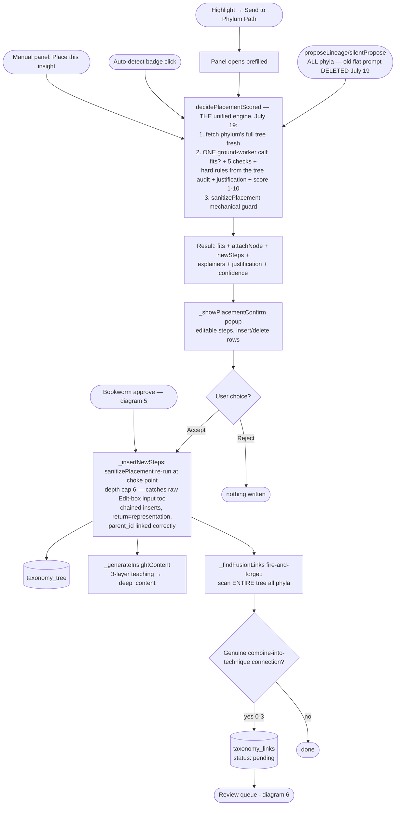
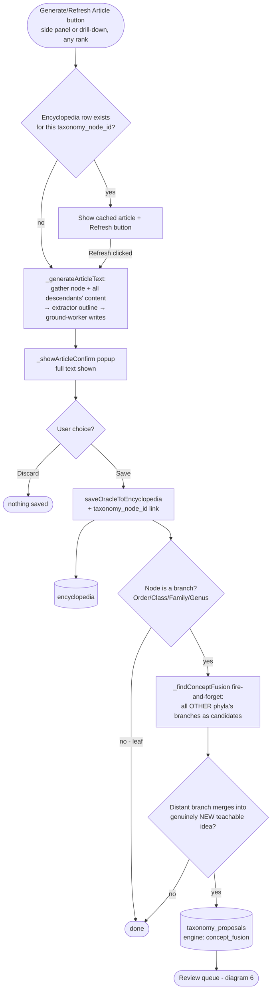
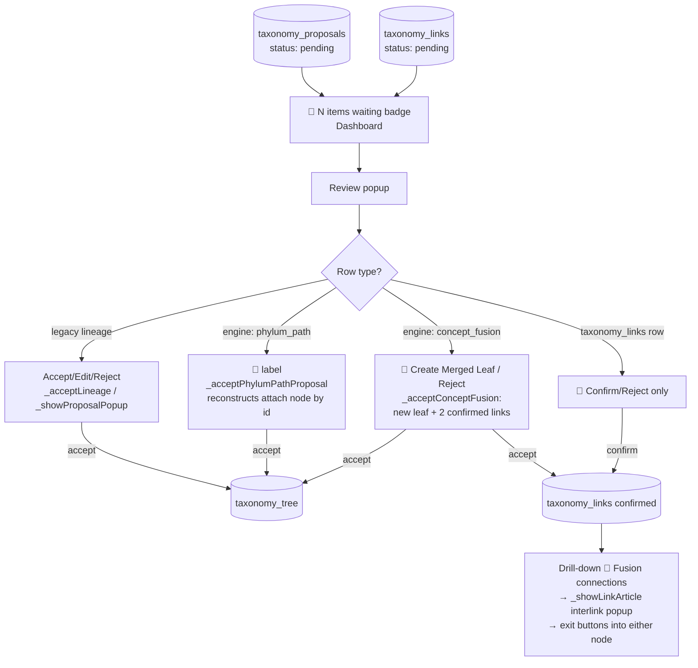
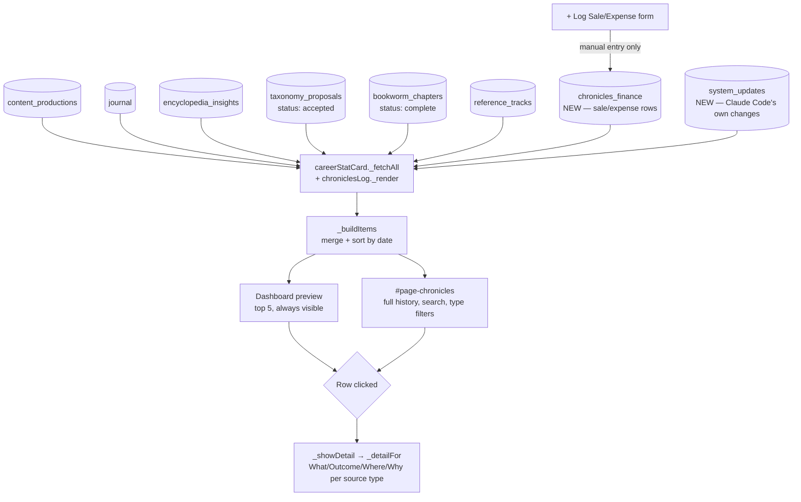
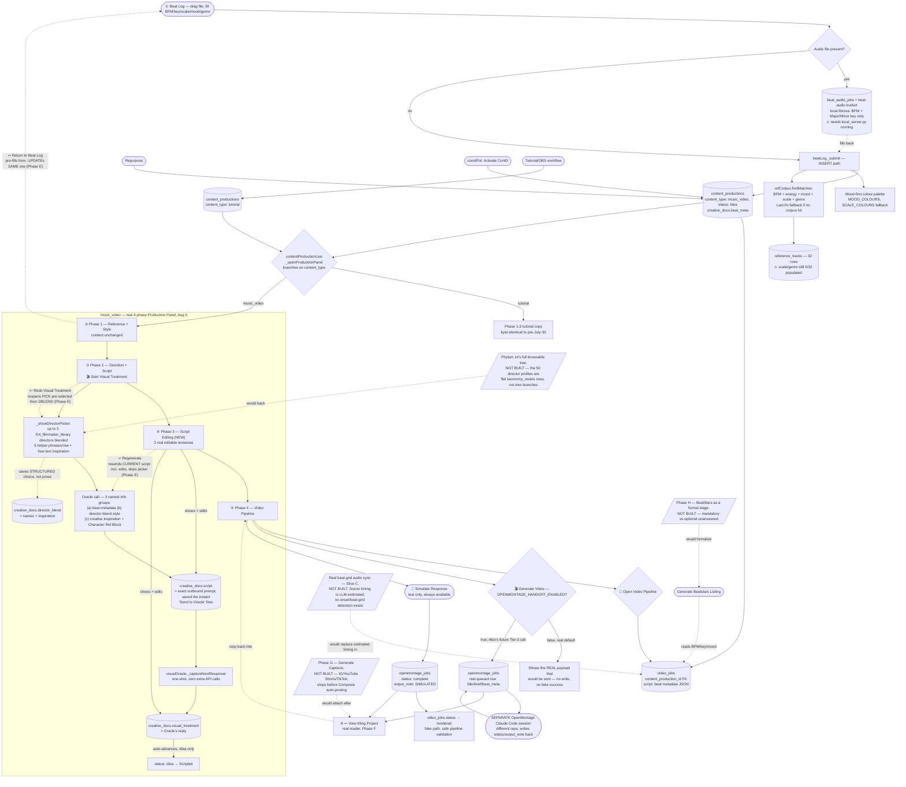

# RPGACE — System Flow Map
**The 5th Oversight doc.** Created July 17, 2026 from a full audit of all oversight files + the live codebase (`main.js`, `rpgace_core.js`, `api/*`, `index.html`). **Last re-verified Aug 5, 2026** (Council of 5 + GODMODE/`/scope`/`/commit-archaeologist`-informed oversight sweep after Phases A-F of the Content/Video Pipeline unification — §11's diagram fully rebuilt around the real 4-phase Production Panel + retroactive edit-in-place loop + Phase F's OpenMontage handoff, §10 gained an Aug 5 truth-table block). Prior re-verification: July 31, 2026 (module inventory re-grepped, table list rebuilt from `pg_policies`; record in `oversight_doc_audit_and_reshape_2026-07-31.txt`). This line gets bumped whenever a real re-verification pass runs, not just on creation. Diagrams are Mermaid — render on GitHub, in VS Code, or any Mermaid viewer. Every diagram follows the same convention: **rectangles = processing**, **diamonds = yes/no decisions**, **cylinders = data stores**, **stadiums = entry/exit points**, **dashed boxes = PLANNED, not built**.

Companion to CLAUDE.md (the operational guide). Update BOTH when architecture changes.

---

## 0. Verified Component Inventory

**Module inventory re-grepped Aug 5** (`grep -oP "RPGACE\.register\('\K[^']+"` against `rpgace_core.js`, deduplicated): **53 real registered modules**, listed by name below, not just counted. The count moved 52 → 53 because `tiktokOracle` was added Aug 5 (Phase G curveball 2 — a real TikTok-specific Oracle panel, mirroring `youtubeOracle`'s architecture) and never entered this table. `myFeature` (SCHEDULE) is a real, oddly-named module — confirmed by reading its source, not a stray/test leftover.

### Domains and modules (from `rpgace_core.js` markers, re-grepped July 31)

| Domain | Modules |
|---|---|
| ORACLE | youtubeOracle, tiktokOracle, prodOraclePanel, instaOraclePanel, quickActions, visualOracle, contentRepurpose, oracleAppGrounding, oracleDevBridge, oracleFetchGuard, oracleTreeGrounding, agentsIntoOracle |
| LEARNING | feynman, encSync, ciAutoPropose, taxonomyReviewQueue, encTaxonomyLink, agendaReminder, scheduleOracle, intelDelete, taxonomySync, knowledgeGap, taxonomyTree, phylumPath, bookworm, encyclopediaQoL, intelBatchList, intelDedup, jargonEncyclopedia, researchTabs |
| CONFIG | config (defines `RPGACE.sb`, `RPGACE.cache`, `RPGACE.hooks`, CONFIG constants) |
| CONTENT | beatLog, refCorpus, contentProductionLive, videoPipeline, conidPot, videoSummary |
| JOURNAL | morningBrief, journalQoL |
| DASHBOARD / NAV | dashDeck, leftNav, pathRouter, chroniclesLog, careerStatCard, docsLinks, pwaInstall |
| SYSTEM | suppressQuestPopup, authGate, perfWatch, voiceInput |
| SCHEDULE | shiftSync, myFeature, scheduleFixes |

### Serverless API (`api/`)
`oracle.js` (Claude proxy, accepts optional `model`), `scout.js` (URL detect + Jina fetch, 8000-char cap), `analyst.js`, `bookworm-fetch.js` (uncapped fetch OR provided fullText → Oracle chapter detection), `composio.js`, `executor.js`, `orchestrate.js`, `noter.js`, `search.js`, `lastfm.js`, `auth.js` (**NEW July 23** — server-side password check + shared-secret issuance, see §10's API-auth entry), `_context.js` (shared: `callClaude`, `MODEL='claude-sonnet-4-6'`, `MODEL_EXTRACTOR='claude-fable-5'`, `fetchURL`, `setCORS`, **`requireAuth` NEW July 23**, Composio `ACCOUNTS`/`TOOL_ALIASES` — single source of truth as of July 23's deduplication fix).

### Supabase tables
**Rebuilt July 31 from a direct `pg_policies` query — 28 real tables, grouped by RLS posture, because the posture is load-bearing.**

*Restricted (`anon_read_only` SELECT + `authenticated_all` — all writes must go through `/api/data-write`'s service-role proxy), 19 tables:* `taxonomy_tree` (recursive, parent_id/depth/path/phylum_number/node_type/explainer/deep_content/sources), `taxonomy_proposals` (staging + review, `proposed_steps.engine` tags: legacy / `phylum_path` / `concept_fusion`), `taxonomy_links` (symmetric fusion links + `link_article`), `taxonomy_nodes` (older flat store — still the home of the `f14_filmmaker_library`/`beatlog_scale_colours`/`f16_licence_terms` reference libraries), `taxonomy_decision_log`, `encyclopedia` (`taxonomy_node_id` links), `encyclopedia_insights`, `content_productions` (ConID + licence/price + `content_type` discriminator + `creative_docs` jsonb), `video_jobs` (F17 — `content_production_id` FK, `style_profile_id`, `edl`), `style_profiles` (Director Match output), `reference_tracks` (beat-matching corpus, +scale/genre/url), `conid_pot`, `bookworm_books`, `bookworm_chapters` (+keywords, suggested_phylum, analysis_complete), `bibliography`, `chronicles_finance`, `oracle_dev_suggestions`, `rpgace_agendas`, `oracle_module_anatomy` (NEW July 31 — Oracle-only per-module architecture/anatomy digest, curated by Claude Code sessions only; deliberately excluded from `api/data-write.js`'s `ALLOWED_TABLES` since nothing in the app writes to it client-side).

*Deliberately still `anon_all` because a real external writer needs the plain anon key — never sweep these into an RLS batch without giving that writer another path, 10 tables:* `journal` (Morning Brief Routine), `oracle_fallback_queue` (Fallback Drain Routine), `openmontage_jobs` (the separate OpenMontage Claude Code session), `beat_audio_jobs` (local librosa runner), `intel_jobs`/`intel_reports`/`intel_watchlist`/`intel_bibliography` (`local_server.py`, port 7842 — `intel_bibliography` is a real, unrelated table sharing a near-identical name with `bibliography`), `rpgace_shifts` (external Python browser-use script), `system_updates` (written by Claude Code sessions via MCP).

*Views:* `book_knowledge`/`jargon_encyclopedia` (both `security_invoker`).

*Storage:* `beat-audio` bucket (Beat Log's librosa uploads).

### The two real hubs (confirmed in interconnection_map.md)
Everything converges on **Oracle** (`callOracle`/`sendChat`/`api/oracle.js`) and the **Taxonomy Tree** (`taxonomy_tree` + its propose/review cycle) — except SCHEDULE, which runs fully independent.

---

## 1. Top-Level System Map

```mermaid
flowchart TD
    subgraph INPUTS[Input Surfaces]
        CHAT([Oracle chat])
        PANELS([Oracle panels: Prod/Insta/YouTube/Visual])
        CI([Content Intelligence video URL])
        SCHED([Schedule Oracle: URL/text])
        BW([Bookworm: URL / TOC paste / PDF upload])
        MANUAL([Manual: Beat Log, ConID, shifts, agendas])
        HIGHLIGHT([Text-select highlight])
    end

    subgraph PROCESS[Processing Core]
        ORACLE[callOracle / api/oracle.js<br/>+ extractor/ground-worker 2-tier for Phylum Path]
        SCAN[Shared phyla-scan<br/>oracle:response-scanned hook]
        PLACE[phylumPath.decidePlacement<br/>5-check reasoning]
        REVIEW[taxonomyReviewQueue<br/>3 card types + fusion links]
    end

    subgraph STORES[(Data)]
        TREE[(taxonomy_tree)]
        PROPS[(taxonomy_proposals)]
        LINKS[(taxonomy_links)]
        ENC[(encyclopedia)]
        CONID[(content_productions)]
        BOOKS[(bookworm_books/chapters)]
        BIB[(bibliography)]
    end

    subgraph OUTPUTS[Output Surfaces]
        DRILL([Phylum Path nav-tab drill-down])
        DASH([Dashboard widgets])
        ENCPG([Encyclopedia page])
        TAXMAP([taxonomy_map.html - live query])
    end

    CHAT --> ORACLE
    PANELS --> ORACLE
    HIGHLIGHT --> PLACE
    CI --> SCAN
    SCHED --> ORACLE
    BW --> PLACE
    ORACLE --> SCAN
    SCAN -->|badge clicked| PLACE
    PLACE -->|confirmed| TREE
    PLACE -->|staged| PROPS
    PROPS --> REVIEW
    REVIEW -->|accept| TREE
    REVIEW -->|accept fusion| LINKS
    TREE --> DRILL
    TREE --> TAXMAP
    ORACLE -->|articles| ENC
    ENC --> ENCPG
    MANUAL --> CONID
    BW --> BOOKS
    BOOKS -->|book complete| BIB
    LINKS --> DRILL
    CONID --> DASH
    BOOKS --> DASH
```

---

## 2. Oracle Chat Request Flow (`main.js sendChat` + wraps)

```mermaid
flowchart TD
    START([User sends chat message]) --> INFLIGHT{Oracle request<br/>already in flight?}
    INFLIGHT -->|yes| BLOCK[Toast: wait for it to finish] --> END1([stop])
    INFLIGHT -->|no| BWTRIG{Starts with<br/>'bookworm:' prefix?}
    BWTRIG -->|yes| BWSTART[bookworm._startBook with URL] --> END2([Bookworm pipeline - diagram 5])
    BWTRIG -->|no| SCHTRIG{Starts with<br/>'schedule oracle:' prefix?}
    SCHTRIG -->|yes| SCHPANEL[scheduleOracle._openPanel prefilled] --> END3([Schedule Oracle pipeline])
    SCHTRIG -->|no| SEND[Original sendChat:<br/>ORACLE_SYS + live 21-phylum list<br/>via taxonomyTree.PHYLUM_NAMES]
    SEND --> API[POST /api/oracle → callClaude<br/>model: claude-sonnet-4-6]
    API --> OK{Response OK?}
    OK -->|no - timeout/504| ERR[JSON parse error surfaces<br/>KNOWN OPEN BUG: 504 on long responses]
    OK -->|yes| RENDER[addMsg renders response]
    RENDER --> SCAN[RPGACE.utils phyla-scan fires<br/>'oracle:response-scanned' hook]
    SCAN --> MATCH{Any ENABLED_PHYLA<br/>keyword match?}
    MATCH -->|yes| BADGE[🧬 Add to Phylum Path? badge<br/>1 click → _placeInsight directly]
    MATCH -->|no| NOBADGE[no badge]
    RENDER --> IDEAS{Looks like ideas response?<br/>INSTA-ORACLE / 3+ numbered}
    IDEAS -->|yes| SAVEBTN[💡 Save ideas to bank button]
    RENDER --> QUEST{Contains QUEST: lines?}
    QUEST -->|yes| QPOPUP[Quest suggestion popup]
```

---

## 3. Phylum Path Insight Placement (the core taxonomy write path)

```mermaid
flowchart TD
    E1([Manual panel: Place this insight]) --> DP
    E2([Auto-detect badge click]) --> DP
    E3([Highlight → Send to Phylum Path]) --> PANEL[Panel opens prefilled] --> DP
    E4([proposeLineage/silentPropose<br/>ALL phyla — old flat prompt DELETED July 19]) --> DP
    E5([Bookworm approve — diagram 5]) --> INS

    DP[decidePlacementScored — THE unified engine, July 19:<br/>1. fetch phylum's full tree fresh<br/>2. ONE ground-worker call: fits? + 5 checks +<br/>hard rules from the tree audit + justification + score 1-10<br/>3. sanitizePlacement mechanical guard] --> DECIDE
    DECIDE[Result: fits + attachNode + newSteps +<br/>explainers + justification + confidence] --> CONFIRM[_showPlacementConfirm popup<br/>editable steps, insert/delete rows]
    CONFIRM --> USER{User choice?}
    USER -->|Reject| STOP([nothing written])
    USER -->|Accept| INS[_insertNewSteps:<br/>sanitizePlacement re-run at choke point<br/>depth cap 6 — catches raw Edit-box input too<br/>chained inserts, return=representation,<br/>parent_id linked correctly]
    INS --> TREE[(taxonomy_tree)]
    INS --> CONTENT[_generateInsightContent<br/>3-layer teaching → deep_content]
    INS --> FUSION[_findFusionLinks fire-and-forget:<br/>scan ENTIRE tree all phyla]
    FUSION --> FOUND{Genuine combine-into-<br/>technique connection?}
    FOUND -->|yes 0-3| PENDING[(taxonomy_links<br/>status: pending)]
    FOUND -->|no| DONE([done])
    PENDING --> RQ([Review queue - diagram 6])
```

---

## 4. Article Generation + Concept Fusion

```mermaid
flowchart TD
    BTN([Generate/Refresh Article button<br/>side panel or drill-down, any rank]) --> CACHED{Encyclopedia row exists<br/>for this taxonomy_node_id?}
    CACHED -->|yes| SHOW[Show cached article + Refresh button]
    CACHED -->|no| GEN
    SHOW -->|Refresh clicked| GEN
    GEN[_generateArticleText:<br/>gather node + all descendants' content<br/>→ extractor outline → ground-worker writes] --> POPUP[_showArticleConfirm popup<br/>full text shown]
    POPUP --> CHOICE{User choice?}
    CHOICE -->|Discard| X([nothing saved])
    CHOICE -->|Save| SAVE[saveOracleToEncyclopedia<br/>+ taxonomy_node_id link]
    SAVE --> ENC[(encyclopedia)]
    SAVE --> CF{Node is a branch?<br/>Order/Class/Family/Genus}
    CF -->|no - leaf| DONE([done])
    CF -->|yes| CFRUN[_findConceptFusion fire-and-forget:<br/>all OTHER phyla's branches as candidates]
    CFRUN --> CFFOUND{Distant branch merges into<br/>genuinely NEW teachable idea?}
    CFFOUND -->|no| DONE
    CFFOUND -->|yes| STAGE[(taxonomy_proposals<br/>engine: concept_fusion)]
    STAGE --> RQ([Review queue - diagram 6])
```

---

## 5. Bookworm (whole-book → taxonomy pipeline)

```mermaid
flowchart TD
    U1([📖 Start: paste URL]) --> FETCH[api/bookworm-fetch:<br/>uncapped Jina fetch]
    U2([✍️ Paste table of contents]) --> TOC[_startBookFromTOC:<br/>Oracle extracts chapter list<br/>+ keywords + suggested_phylum]
    U3([📎 Upload own purchased PDF<br/>⚠ UNTESTED]) --> PDFX[PDF.js client-side text extraction<br/>raw file never leaves browser] --> FETCH2[api/bookworm-fetch with fullText<br/>skips Jina]
    FETCH --> DETECT
    FETCH2 --> DETECT
    DETECT[Oracle-PRIMARY chapter detection<br/>knows TOC + summary-section decoys<br/>regex only as fallback<br/>+ dropClusteredBoundaries backstop] --> DOK{≥1 chapter found?}
    DOK -->|no| ERRX[Clear error - never fake success]
    DOK -->|yes| CREATE[_createBookFromExtraction:<br/>book + all chapter rows upfront<br/>return=representation + ok-checks]
    TOC --> CREATE
    CREATE --> FOUND[📚 Contents Found screen:<br/>full chapter list + keywords + phylum<br/>▶ Start Chapter 1]
    FOUND --> OPEN[_openBook at current_chapter_index]
    OPEN --> HASTEXT{Chapter has raw_text?}
    HASTEXT -->|no - TOC-entered book| ADDTEXT[Prompt: paste THIS chapter's body<br/>_looksLikeTableOfContents warns<br/>on TOC-shaped paste] --> OPEN
    HASTEXT -->|yes| HASINS{Chapter has insights?}
    HASINS -->|no| READ[Read view: full chapter text<br/>✓ I've Read This]
    READ --> ANALYZE[_analyzeChapter:<br/>extract all insights<br/>phylum from suggested_phylum if present<br/>place insight 1 ONLY, await it]
    ANALYZE --> BG[_continueAnalyzingInBackground:<br/>insights 2..N append as each finishes<br/>analysis_complete flag when done]
    ANALYZE --> RVW
    HASINS -->|yes| RVW[Per-insight review:<br/>summary → path → justification]
    RVW --> DEC{User choice?}
    DEC -->|Approve| LEAF[phylumPath._insertNewSteps<br/>creates the leaf] --> NEXT
    DEC -->|Reject| NEXT[current_insight_index + 1]
    DEC -->|Edit| OWN[User's own slash-path<br/>inserted directly] --> NEXT
    NEXT --> MORE{More insights loaded?}
    MORE -->|yes| RVW
    MORE -->|no| DONEANLZ{analysis_complete?}
    DONEANLZ -->|no| WAIT[Poll every 4s] --> MORE
    DONEANLZ -->|yes| CHDONE[Chapter complete<br/>current_chapter_index + 1]
    CHDONE --> LASTCH{More chapters?}
    LASTCH -->|yes| OPEN
    LASTCH -->|no| BIB[(bibliography row:<br/>chapters, insights, phyla touched)]
    BIB --> RESEARCH([📚 Bibliography section, Research page])
```

**Insight placement cascade inside `_analyzeChapter`** (per insight):

```mermaid
flowchart TD
    I([Insight text]) --> P1[Try suggested/primary phylum<br/>_decidePlacementScored:<br/>fits? + placement + justification + score 1-10<br/>_sanitizeNewSteps backstop]
    P1 --> S{Score?}
    S -->|9-10| SHOW([Show to user])
    S -->|5-8, retries left| RW[_rewordInsight → retry same phylum<br/>max 3 attempts] --> P1
    S -->|under 4| UP{_checkUpgradeable:<br/>more concrete version exists?}
    UP -->|yes| P1
    UP -->|no| NEXTPH{More enabled phyla to try?}
    S -->|5-8, no retries| SHOW
    P1 -->|doesn't fit this phylum| NEXTPH
    NEXTPH -->|yes| P1
    NEXTPH -->|no| BROAD[_finalPlacementSearch:<br/>all 21 phyla, orphan rescue]
    BROAD --> BF{Home found?}
    BF -->|yes| SHOW
    BF -->|no| UNPL([Shown as unplaceable —<br/>never forced into a leaf])
```

---

## 6. Review Queue (Dashboard — all pending taxonomy decisions)

```mermaid
flowchart TD
    SRC1[(taxonomy_proposals<br/>status: pending)] --> BADGE[🌳 N items waiting badge<br/>Dashboard]
    SRC2[(taxonomy_links<br/>status: pending)] --> BADGE
    BADGE --> QUEUE[Review popup]
    QUEUE --> TYPE{Row type?}
    TYPE -->|legacy lineage| L[Accept/Edit/Reject<br/>_acceptLineage / _showProposalPopup]
    TYPE -->|engine: phylum_path| PP[🧬 label<br/>_acceptPhylumPathProposal<br/>reconstructs attach node by id]
    TYPE -->|engine: concept_fusion| CFC[🌌 Create Merged Leaf / Reject<br/>_acceptConceptFusion:<br/>new leaf + 2 confirmed links]
    TYPE -->|taxonomy_links row| FL[🔗 Confirm/Reject only]
    L -->|accept| TREE[(taxonomy_tree)]
    PP -->|accept| TREE
    CFC -->|accept| TREE
    CFC -->|accept| LINKS[(taxonomy_links confirmed)]
    FL -->|confirm| LINKS
    LINKS --> DRILL[Drill-down 🔗 Fusion connections<br/>→ _showLinkArticle interlink popup<br/>→ exit buttons into either node]
```

---

## 7. Content Intelligence & Schedule Oracle ingestion

```mermaid
flowchart TD
    CIURL([Video URL via local_server.py :7842<br/>⚠ requires laptop running]) --> CIA[Analysis pipeline<br/>58 analysed, watchlist, scoring]
    CIA --> CIPROP[ciAutoPropose → taxonomy_proposals]
    CIPROP --> RQ([Review queue - diagram 6])

    SO([Schedule Oracle: URL or text]) --> SCOUT[api/scout: URL? → Jina fetch<br/>⚠ 8000-char cap — intentional,<br/>Bookworm has its own uncapped path]
    SCOUT --> JOK{Jina fetch worked?}
    JOK -->|no| SILENT[⚠ OPEN BUG F11: silent<br/>Content Unavailable placeholder]
    JOK -->|yes| ANALYST[api/analyst: type-aware analysis]
    ANALYST --> THREE[Sequential 3-option reveal:<br/>Schedule / Encyclopedia / Taxonomy]
```

---

## 8. PLANNED features (dashed = not built) and where they attach

```mermaid
flowchart TD
    subgraph BUILT[Built today]
        BWPIPE[Bookworm pipeline]
        RVW[Per-insight review popups]
        TREE[(taxonomy_tree)]
        DP[decidePlacement]
        BK[(book_knowledge view<br/>July 22)]
        JE[(jargon_encyclopedia view<br/>July 22)]
        FALLBACK[Claude Code fallback lane<br/>built July 24 — real, unexercised<br/>see claude_fallback_build_plan_2026-07-24.txt]
        FBQ[(oracle_fallback_queue<br/>real table, created July 24)]
        MB2[RPGACE Fallback Drain Routine<br/>trig_01QxebLsiPMVksNSVjNECdbD, hourly]
    end

    subgraph PLANNED[Planned — attach points shown]
        CARDS[/"Live-study card list UI<br/>ConID-card pattern: per-chapter cards,<br/>edit title, status, context action.<br/>REPLACES the modal-per-step flow,<br/>calls the SAME _openBook/_renderInsightReview logic"/]
        DEBATE[/"/debate skill run on a real topic:<br/>Claude's general knowledge vs.<br/>a specific gathered tree insight —<br/>comparison only, never auto-writes"/]
        F12[/"Schedule Oracle Phase 2:<br/>carousel, two-tier session memory, auto-routing"/]
        PHYLA11[/"The REMAINING phyla through the<br/>7-step Development Framework:<br/>12, 13, 15-21. Phyla 11 + 14 cleared it<br/>July 30 and are live in ENABLED_PHYLA"/]
        EPUB[/"EPUB/other-format upload<br/>same _createBookFromExtraction path<br/>as PDF upload"/]
    end

    CARDS -.->|renders| BWPIPE
    CARDS -.->|reuses| RVW
    DP -.->|already shared by book + non-book, July 19| BWPIPE
    BK -.->|unnests, read-only| BWPIPE
    JE -.->|selects leaves, read-only| TREE
    DEBATE -.->|compares against, never writes| TREE
    PHYLA11 -.->|extends ENABLED_PHYLA| DP
    EPUB -.->|new entry point| BWPIPE
    F12 -.->|extends| SO2[Schedule Oracle]
    FALLBACK -->|catches credit-exhaustion errors from| GW[the 3 shared ground-worker functions<br/>_callExtractor/_callGroundWorkerJSON/_callGroundWorkerText]
    FALLBACK -->|queues into| FBQ
    FBQ -->|drained by| MB2
    MB2 -->|resumes via bookworm._resumeFromFallback /<br/>taxonomyTree._resumeSilentProposeFromFallback| BWPIPE
```

**July 22 correction**: the "Taxonomy Sorting Agent" and "Claude general-knowledge audit" nodes that used to sit in the PLANNED subgraph above are gone — tracing the real call chain showed `decidePlacement` already IS the one shared engine for book and non-book inputs (no separate agent was ever needed), and the general-knowledge audit was redesigned around `/debate` (comparison only, gated behind an explicit human decision to ever write anything) rather than the original 3-part tree-seeding design. `book_knowledge` and `jargon_encyclopedia` — what the Sorting Agent was actually described as blocking — are both shipped, read-only Postgres views over data already written by the existing pipeline above.

**July 24 — Claude Code fallback lane, judged, confirmed, and built the same session.** Judged first via `/debate`+Council-of-5+`/5thDimension` (`openmontage_and_claude_fallback_spec_backlog_2026-07-24.txt`), then a real evidence pass + a second `/debate` on scope (`claude_fallback_build_plan_2026-07-24.txt`) before any code was written. Scoped honestly as an async/batch fallback for background AI jobs only (Bookworm chapter analysis fully wired; Content Intelligence's silent taxonomy proposals fully wired; both reuse the same 3 shared ground-worker functions per rule 3) — never a live-chat replacement, since Claude Code Remote's `create_trigger` has a real hourly-minimum interval. Reuses River IX's own already-built mechanism (a Routine reading a Supabase reservoir on its own clock, same shape as the real Morning Brief Routine) rather than inventing a new one. Moved from PLANNED to BUILT because the table, the code, and the Routine all now genuinely exist — moved here rather than left dashed, but honestly flagged as **not yet exercised against a real credit-exhaustion event** (forcing one on purpose would mean actually draining Alex's own Anthropic credits). A real pre-existing bug was found and fixed in the same pass: none of the 3 shared ground-worker functions ever checked for an API error before this — one of them (`_callGroundWorkerText`) used to silently return an empty string on ANY failure. OpenMontage, judged the same session, does NOT appear anywhere in this diagram — its verdict was adopt as a fully separate operated tool, never an RPGACE-embedded flow, so it has no attach point here at all.

---

## 9. The Chronicles (activity-log aggregation + finance ledger) — added July 22

```mermaid
flowchart TD
    T1[(content_productions)] --> AGG[careerStatCard._fetchAll<br/>+ chroniclesLog._render]
    T2[(journal)] --> AGG
    T3[(encyclopedia_insights)] --> AGG
    T4[(taxonomy_proposals<br/>status: accepted)] --> AGG
    T5[(bookworm_chapters<br/>status: complete)] --> AGG
    T6[(reference_tracks)] --> AGG
    T7[(chronicles_finance<br/>NEW — sale/expense rows)] --> AGG
    T8[(system_updates<br/>NEW — Claude Code's own changes)] --> AGG
    AGG --> BUILD[_buildItems<br/>merge + sort by date]
    BUILD --> DASH[Dashboard preview<br/>top 5, always visible]
    BUILD --> LOG[#page-chronicles<br/>full history, search, type filters]
    DASH --> CLICK{Row clicked}
    LOG --> CLICK
    CLICK --> DETAIL[_showDetail → _detailFor<br/>What/Outcome/Where/Why per source type]
    FORM[+ Log Sale/Expense form] -->|manual entry only| T7
```

Real design choice, not an oversight: `chronicles_finance` feeds Chronicles' display but is deliberately **excluded** from the career-score XP/Level formula computed in the same `_fetchAll` pass — confirmed via interrogation this is a separate visibility lane. `bookworm_chapters` feeds the cumulative Growth *count* but is excluded from the streak/recent-activity date logic (its `created_at` is a bulk-insert timestamp from TOC detection, not real per-chapter completion time — would show a misleading date otherwise).

---

## 10. Built vs NOT built — the truth table (created July 17; live numbers re-queried July 31)

### Built AND verified working (hand-tested or confirmed live)
- Phylum Path across **12 live phyla** (`ENABLED_PHYLA:[1..10, 11, 14]`): switcher, drill-down, placement, confirm popups, auto-detect badge. Phyla 11 + 14 were added July 30 as 14 real category leaves (6 + 8), not ~110 per-term leaves — an existing jargon-bucket precedent in the tree changed the build mid-execution.
- Placement logic hand-tested across 8 of the original 10 enabled phyla (data-layer); 11 and 14 are **not** hand-tested.
- Concept Fusion full propose→accept cycle (data-layer)
- Fusion links: creation, review, display. **Live count re-queried July 31: 66 total, 66 confirmed, 0 pending** (the long-quoted "21 confirmed / 47 pending / 68 total" is a stale July 20 figure — Alex has since worked the pending queue to zero). Standing caveat unchanged: the near-100% lifetime confirm rate is a known-contaminated statistic (a rapid clear-through, not real review) — never cite it as a quality signal.
- Live taxonomy state, same query: **544 `taxonomy_tree` rows; 52 `taxonomy_proposals` still pending** (down from the 60-pending July 24 triage figure and the "77-item backlog" that included fusion links).
- Review queue with all 3 proposal types + link cards
- Bookworm: streaming analysis (verified <1 min to first insight), delete button, checkpoint/resume, placement-path sanitizer
- **Bookworm full insight-review loop, July 18: `_analyzeChapter` → Council-of-5 scored placement → Approve/Reject/Edit checkpoint → live `taxonomy_tree` write, confirmed end-to-end on a real chapter** (1 genuine reject, 2 genuine approvals) — manual/TOC-paste book only, see caveat below
- TOC-paste chapter detection (`_startBookFromTOC`) — confirmed correct on a real full 27-chapter book, July 18
- **PDF-upload chapter detection, rebuilt and fully verified July 18: `detectChapterListByOracle()` + `resolveChapterHeadingsMechanically()`** — 26 of 26 real chapters, correct titles, correct reading order, zero warnings, on a real 400,000+ character book with two distinct real PDF-text-corruption patterns present (words joined with no space, words split with an inserted space). The longest debugging arc in Bookworm's history (8 real rounds, each diagnosed from Vercel logs/Supabase queries/Alex's own pasted raw text, never a blind second guess) — see patch_notes.html's 🏁 finish-line card for the full account.
- Grounded Oracle (no more invented phyla), request cross-wiring guard
- Content Intelligence end-to-end; cross-device sync (shifts, agendas)

### Built but NEVER verified — treat as unconfirmed, test before building on
- **Left slide-out nav drawer (`leftNav` module, July 20) replacing the top `.nav-tabs` bar** — 9 top-level pages + nested Research/Schedule sub-navs, reasoning-verified (z-index stacking, main.js no-op safety, patch-level code review) but never opened in a real browser.
- **Research Lab tab-content fix (July 20)** — Idea Bank/Corpus/Beat Log were nested inside `#video-workshop-panel` (hidden whenever another tab was active) and Bibliography was rendering above the page title on every visit; both root causes fixed, plus 4 modules' cold-load init reactivated (dead `rpgace:ready` listener pattern). Code-reviewed correct, not yet clicked through live.
- **Dashboard command deck (`dashDeck`, July 20, 5 commits)** — 11-card grid, widget-relocation popups, quest board moved to Agenda. Passes 1/1.5 were seen live by Alex (he reported real bugs against them); the relocation pass, the popup-close fix, and pass 2 have never been viewed in a browser.
- **Bookworm's chapter-by-chapter read→insight→approve loop, on the PDF-upload book — the combined run DID happen (July 19, corrected July 20).** Direct Supabase check of `bookworm_chapters` for book_id `70fd8faa-…531baa` ("Music Theory for Computer Musicians") shows chapter_index 7/9/12 (human chapters 8/10/13) all `status=complete` with 17/10/12 insights (39 total), plus chapter 1 (index 0) `in_progress` at 6 insights. So chapter detection AND the insight-review loop HAVE now run together on the same real PDF book — but on the **OLD pre-retune, pre-July-20-UI engine** (these are literally the garbage runs — ch-13 fragmentation, ch-1 shoehorning — that triggered the July 19 tree audit + token retune). The real open test is narrowed accordingly: **one clean chapter through the POST-retune unified engine + the July 20 dashboard/nav UI** (resume chapter 1 or open the next unstudied chapter) — NOT a first-ever combined run, which already exists. (Housekeeping: a duplicate `bookworm_books` row for the same book, id `87268196-…845513f`, all chapters pending / zero real progress — harmless; real progress lives on the other book_id.)
- `_looksLikeTableOfContents()` warning heuristic — never observed catching the real mistake
- Bookworm end-to-end: **no book has ever completed the full pipeline** (structure detection is now solid on both entry points; still no book has been walked start to finish)
- Bibliography section render (no completed book exists to show)
- `bookworm:` chat trigger; browser-side render of concept-fusion/fusion-link review cards; interlink article popup; grouped phylum switcher; drill-down Back button — all built this session, none re-clicked after building
- F16 Beatstars listing, F17 video pipeline stages, F18 auto visual treatment, highlight-to-Phylum-Path button (pending since July 13-15)
- **`book_knowledge` + `jargon_encyclopedia` views + the Jargon Encyclopedia button (July 22)** — real row counts confirmed via direct query (33/150), `security_definer_view` lint found and fixed, real headless Playwright run confirmed the button/popup/graceful-failure path — but never clicked through by Alex in a real browser.
- **`/debate` skill (July 22)** — built and code-reviewed, never actually run on a real topic yet (Alex asked to hold off rather than pick one this pass).
- n8n rota sync (F10) — importable, never test-run
- **Oracle self-awareness + Claude Code bridge (July 22, 6 pieces, none hand-tested):** `oracleAppGrounding` (dashboard/status grounding), `oracleFetchGuard` (fetched-content prompt-injection hardening), `oracleDevBridge` (Flag-for-Claude-Code button + `oracle_dev_suggestions` table), `taxonomy_decision_log` audit-log write hook at `_insertNewSteps`, Council of 5's conversation-capture button (`fillGaps` `opts.allowConversationCapture`), and the daily Morning Brief Routine (fires for real tomorrow morning for the first time). `node --check` clean on every pass; zero of it clicked through live yet.
- **Nav-lag root cause fixed twice, same day (July 22)** — a live crash from an early sidebar fix (module registration aborted mid-parse) was reverted, then root-caused for real (`leftNav`/`config` init-order race, defensive guard + retry added). A separate, deeper report ("nav doesn't respond for ~10s after login") traced `onReady()` to gating the whole module-registration cascade behind `window.load` (every image/font) instead of `DOMContentLoaded` — a systemic fix improving every module's startup, verified via real headless Playwright runs (not just code review, unlike the July 20 entries above).
- **RPGACE is now an installable PWA (July 22)** — `manifest.json` + `sw.js` (network-first, deliberately not cache-first) + generated icon set + a boot-loader overlay gating the login screen until every module has registered. Verified end-to-end via headless Playwright (boot loader hides, gate appears, login succeeds, nav responds instantly) — **never installed on a real Android device by Alex yet.**
- **Career stat card + The Chronicles (July 22)** — the profile card's HP/MP/Streak (confirmed 100% cosmetic, never touched by any code) and XP/Level (in-memory only, reset every load) replaced with a real weighted score from Supabase (Output = shipped content, Growth = learning/tree activity, kept as separate lanes). "Recent Wins" renamed The Chronicles, given a full searchable `#page-chronicles` log page with click-through detail on every real entry, plus a new `chronicles_finance` ledger table for personal-visibility sale/expense tracking. Verified via real headless Playwright runs (navigation, form validation, network-failure fallback) — **never viewed in a real browser by Alex.**
- **`/scope` skill + `system_updates` table (July 22)** — a reusable oversight-evidence-gathering skill, and a new Supabase table so Chronicles now also shows Claude Code's own real changes to RPGACE, not just Alex's in-app activity. This whole truth-table update was itself produced using `/scope`'s own methodology.
- **`/5thDimension` skill + Oracle command (July 23)** — a 6-phase meta-protocol reconciling built-vs-reported state, built from GODMODE/Council of 5/Omnitrix/Aintergration/`/scope`/`/debate` run in sequence. Ran once end-to-end (Phases 1-4): found near-zero real doc-vs-code drift, plus 7 smaller real findings and a prioritized rewiring debate. Also added as the 16th RPGACE Oracle AI command, scoped honestly to what Oracle can verify from its own live grounding vs. what needs a real Claude Code session.
- **API auth + password moved server-side (July 23, Tier 3, Alex-authorized "do now") — BUILT, node --check clean, tested via a mock Vercel-shaped server + real headless Playwright through the actual login UI end-to-end, but NOT merged to `main` / NOT live** — see the deployment-gate note above. `main.js`'s `checkPassword()` is a deliberate, logged FROZEN-file exception.
- **Deduplication fix in `api/composio.js`/`api/search.js` (July 23)** — found while applying new CLAUDE.md rule 8: `composio.js` had its own divergent `ACCOUNTS` map that had drifted from `_context.js`'s copy, meaning `executor.js`/`orchestrate.js` had silently been using the wrong Gmail/Instagram connected-account ids since a June 28 Composio update. Fixed; `_context.js` is now the single source of truth. Playwright/`node --check` verified; not yet live (bundled with the API-auth commit above, same deployment gate).
- **Research Lab real single-tab lazy loading (July 23)** — reverses a July 22 decision; 6 sub-modules gated behind a new `research:tab-active` hook instead of loading regardless of active tab. A genuine dead-code bug (`researchTabs._inject()` never called) fixed in the same pass. New `dashDeck._openResearch()` popup. Playwright-verified; never clicked through live by Alex.
- **Chronicles card-only + pathRouter (real URLs) + swipeable nav + `perfWatch` diagnostic (July 23)** — the old standalone Chronicles feed is gone, real pushState URLs shipped, left-nav gained a swipe gesture, and a passive `PerformanceObserver('longtask')` watcher now reports real main-thread freezes as a visible toast. Playwright-verified; a real freeze on the swipe gesture specifically (confirmed via `perfWatch`'s own toast, 23s) is still open, not yet root-caused.
- **Oracle self-awareness partially made live (July 23)** — real module count + a live taxonomy-backlog number now append to `oracleAppGrounding`'s digest, fail-open if unavailable. Playwright-verified; never viewed in a real Oracle conversation by Alex.
- **Every boot-time UI injector moved onto a shared `RPGACE.registerBootTask` gate (July 24)** — Alex: "no loads should happen after login, only before." ~24 modules that used to `setTimeout` their dashboard/page injection after login now register with the boot loader instead, which waits on all of them via `Promise.all` before hiding. `page:show`/`research:tab-active`-gated re-injection (the deliberate lazy-load pattern for not-yet-visited pages) is untouched — a different, legitimate mechanism.
- **Approach B's authenticated write-proxy — independently confirmed end-to-end for real (July 25), not just gated.** 8 real user writes (via the dashboard Review Queue, not a test script) landed 90 minutes after the RLS flip below, on tables where `anon` is SELECT-only — proving both UPDATE (`taxonomy_proposals`/`taxonomy_links`) and INSERT (`taxonomy_tree`/`taxonomy_decision_log`, via one real accept chain with a matching `node_id`) genuinely work through `/api/data-write`. DELETE through the proxy, and the 6 deliberately-excluded tables, remain unconfirmed — named honestly, not folded into a blanket "it works."
- **July 26-31 block — everything below is code-verified / `node --check` clean and live on `main`, and NONE of it has been clicked through by Alex in a real browser.** Added July 31; this whole stretch was missing from the truth table.
  - **Oracle 504 streaming fix (July 28)** — `api/oracle.js` proxies a real Anthropic SSE stream on `stream:true`; `callOracle()` gained an optional `onChunk`; `sendChat()` renders progressively through the XSS-safe `renderMarkdown()`. The prior client-only stub and its `restoreSendChat` neutraliser are deleted. `maxDuration` 300, confirmed `READY` on production. Alex has used it for real once and reported a readability bug, fixed same session.
  - **XSS fix in `main.js`'s `renderMarkdown()` (July 28)** — raw response text went into `innerHTML` unescaped; `_escChatHtml()` now escapes before the markdown regex chain. FROZEN-file exception logged.
  - **160 undersized-text fixes in `rpgace_core.js` + 21 in `index.html`/`style.css` (July 28)** — the static `/impeccable` scanner only reads `index.html`/`style.css`, so the dynamically-generated UI's own 9-10px text was invisible to it. 3 monospace exemptions excluded. 16 wide-tracking + 15 tiny-text + 4 one-off findings remain a real, smaller backlog.
  - **`videoPipeline` + `morningBrief` migrated into real dashDeck cards (July 28)** — both had been injecting loose onto `#page-dashboard`; both now inject into `#dd-stash-holder`. Morning Brief had been two competing implementations (a hollow static prefill card vs. the real live-data module).
  - **Content Pipeline overseer (July 28)** — 3 migrations: `video_jobs.content_production_id` FK, `content_productions.creative_docs` jsonb, and the new `style_profiles` table. `beatLog._submit()` creates the linked `content_productions` row. `visualOracle._captureNextResponse()` (one-shot, on the existing `oracle:response-scanned` hook, zero extra API calls) parses two structured trailers — `DIRECTOR_CHOSEN:` → a real `style_profiles` row, `EDL_JSON:` → a real `video_jobs.edl`. Both previously-dead columns are live design intent again. **`style_profiles` still has 0 rows** — the Director Match save path has never fired successfully in production.
  - **Beat-matching root cause fixed (July 28)** — `reference_tracks.scale`/`genre` existed and were scored but were null on all 32 corpus rows, so every beat tied in the same bucket. Genre added to the Beat Log form, Scale/Genre/`url` to the corpus add-track UI, genre added to `findMatches()`. **Still 0/32 populated** — the backfill popup exists but has not been run.
  - **Local librosa audio analysis (July 29)** — `beat_audio_jobs` table + `beat-audio` Storage bucket + an async queue hook in `beatLog._tryRealAudioAnalysis`. BPM + Major/Minor key only. Needs Alex to add the Python snippet and keep `local_server.py` running.
  - **Voice input (July 29, real accessibility need — one-handed)** — `voiceInput` module: Oracle-chat 🎤 plus a persistent global floating 🎤 targeting the last-focused field. A transcript-duplication bug survived one fix and got a second, more fundamental rewrite (position-tracked idempotency, fresh recognition object per restart). **Genuinely UNVERIFIED** — per the per-defect cap, the next step is real console evidence, not a third guess.
  - **Popup scaffolding fully consolidated (July 30)** — all 26 real hand-rolled overlay sites in `rpgace_core.js` route through `dashDeck._popup()`. One documented exception (`_showEncPopup`, a genuinely different pinned-header/footer layout).
  - **Phylum 11 + 14 built out (July 30)** — plus a real keyword-collision bug Alex diagnosed himself (bare `"cinematic"` in P14 colliding with P11's mood vocabulary) and a Neural Frames → OpenMontage swap across all 6 occurrences.
  - **Video Pipeline Slice A (July 30)** — return-to-Beat-Log nav both directions, `video_jobs` auto-advance stage triggers, a `reference_tracks` backfill popup, and real toasts at every failure point in the Director Match save chain.
  - **`content_type` discriminator (July 30)** — one shared `content_productions` table serving both tutorial and music-video workflows, Production Panel copy branching on it, and `videoPipeline.STAGES`' mislabeled `'raw_footage'` renamed `'in_production'` across all 4 code sites. **Verified live July 31: 4 `tutorial` + 3 `music_video` rows, backfilled correctly.**
  - **Video/Content Pipeline UX pass (July 31)** — "Generate Beatstars Listing" rename, FK-aware ConID delete, a "🎬 Generate Visual Treatment" button on ConID cards, music_video 4-step display labels over the shared `status` column, and a "Script + Treatment" handoff section on Video Pipeline job details.
  - **Director picker + reply-truncation fix (July 31)** — `visualOracle._showDirectorPicker` (dropdown over the 50-row `f14_filmmaker_library` + a "View Style" taxonomy popup + a free-text inspiration box) replaces a plain textbox at both call sites. `main.js`'s `sendChat` `maxTokens` raised 1200 → 3000 (FROZEN-file exception; `max_tokens` is a ceiling billed on tokens generated, so short replies cost the same).
  - **`openmontage_jobs` (July 31)** — a real async handoff table between RPGACE, this session, and a separate OpenMontage Claude Code session in a different repo. First real round-trip completed: the external session set up cleanly, chose the `cinematic` pipeline correctly, and **correctly failed loud** (`status='failed'` with an honest `output_note`) rather than faking a render with generic stock footage for a brief needing a specific recurring character. A provider-independent "Character Reference Block" deliverable was added to the Visual Treatment prompt as a result. Alex has since ruled out paid providers on principle — see the Aug 4 entry below for where this actually went.
  - **OpenMontage free-generation path investigated end-to-end (Aug 4) — real evidence at every step, nothing rendered.** Local GPU (Alex's 1660 Ti, 6GB) confirmed a dead end: real declared VRAM checked in `tools/video/_shared.py` for all 6 bundled local models, smallest (`cogvideo-2b`, 6000MB) equals the card's entire capacity before headroom; GGUF-quantized fallback checked too — mechanism exists, no asset bundled, needs a new ComfyUI install for a still-unconfirmed fit. Free cloud GPU chosen instead: Kaggle over Colab (scriptable Dataset-pull retrieval, guaranteed hours), model `ltx2-local` over `hunyuan-1.5`/`cogvideo-5b` on real fps/quality reasoning, LTX-2's Community License checked live and cleared (free commercial use under $10M ARR). Real correction found along the way: the tool's own `disk_mb:4000` placeholder was off by 7-11x against LTX-2's real Hugging Face size (43.3GB full / 27.1GB fp8 + 2.44GB VAE). Additive `openmontage_jobs` migration shipped (`source_audio_url`, `revision_notes`) — schema ready, nothing populated yet. Full 5-step build plan awaiting Alex's approval: `openmontage_colab_kaggle_integration_spec_2026-08-04.txt`. **Standing directive: next session's `/Routine` dispatches `/Engineer` on this plan's Steps 1-4 before its normal Top-10 debate.**
  - **Oracle architecture/anatomy self-awareness table (July 31) — `oracle_module_anatomy`, 13 curated rows, first batch scoped to the riskiest/most complex modules (Alex's own choice).** Real evidence killed the original "a database both Oracle and Claude Code can use" framing — Claude Code already has better direct access via the repo + `graphify-out/`; the honest deliverable is Oracle-only. `oracleAppGrounding` gained a second keyword gate (`ANATOMY_KEYWORDS`) riding inside its EXISTING `window.callOracle` wrap (not a 4th wrapper) and `_buildAnatomyBlock()`, reusing `oracleTreeGrounding`'s own scan→SELECT→score→top-N retrieval shape rather than a full always-injected blob. Rows: `dashDeck`, `phylumPath`, `authGate`, `oracleAppGrounding`, `oracleTreeGrounding`, `bookworm`, `config`, `taxonomyTree`, `leftNav`, `beatLog`, `contentProductionLive`, `videoPipeline`, `voiceInput` — each with a real `source_ref` file:line pointer and a `gotchas` column mined from CLAUDE.md's own already-written landmines, not invented. `node --check` clean. Full debate record: `oracle_architecture_anatomy_db_debate_2026-07-31.txt`. **Untested — needs Alex to actually ask Oracle an anatomy-shaped question in a real conversation.**
- **Aug 5 block — Content/Video Pipeline unification, Phases A-F, all `/Engineer`-disciplined, ALL code-verified/gate-passed/live-on-`main`, NONE hand-tested (Alex has explicitly deferred hand-testing until all 8 phases ship, verified together in one pass with a real beat).** Full spec + verbatim `/interrogation` answers: `content_video_pipeline_unification_spec_2026-08-05.txt`. Per-phase records: `engineer_pass_2026-08-05_01.txt` through `_05.txt`.
  - **Phase A** — real root-cause fix: colour palette read scale only, never mood; new `MOOD_COLOURS` table drives it now. Status box auto-advances on a real Visual-Treatment save. `content_productions.updated_at` (new column) drives real recency sort.
  - **Phase B stopped, not built** — real evidence showed `findMatches()` is metadata-tag scoring and "Add These Artists" is an unrelated Last.fm mechanism; neither is real audio-similarity matching. Logged as a future build (`beat_audience_matching_engine_future_idea_2026-08-05.txt`) rather than built on the wrong premise.
  - **Phase C** — `_showDirectorPicker` blends up to 3 directors (one shared row-factory), 5 real helper phrases per row split from each director's own `definition`, output restructured into 3 named info groups instead of one mixed sentence.
  - **Phase D** — Production Panel restructured from 3 to 4 real phases for `music_video` ConIDs (Reference+Style / Direction+Script / Script Editing / Video Pipeline); new Script Editing phase saves BOTH the exact outbound prompt (`creative_docs.script`, new field) and Oracle's reply (`creative_docs.visual_treatment`), independently editable. Tutorial's 3-phase branch untouched.
  - **Phase E** — 3 of 4 retroactive buttons became real edit-in-place actions (see §11's diagram for the full loop): Return to Beat Log genuinely UPDATEs the same rows via a new `beatLog._retroTarget` branch; Redo Visual Treatment reopens the picker pre-selected from a new structured `creative_docs.director_blend` field; Regenerate resends the current saved script. "View Kling Project" stayed an honest stub, correctly identified as blocked on Phase F.
  - **Phase F** — real "Generate Video" trigger packaging beat metadata + Visual Treatment + script into the real `openmontage_jobs` row shape, gated behind `OPENMONTAGE_HANDOFF_ENABLED:false` (mirrors `ENABLED_PHYLA`'s shape) — shows the real payload rather than faking success while off. New "Simulate Response" test-only tool fakes a complete job result (zero cost, explicitly `[SIMULATED]`-labeled) so the rest of the pipeline can be validated safely. "View Kling Project" is genuinely real now.
  - Remaining: Phase G (captions, explicitly stops before Composio auto-posting) and Phase H (BeatStars as a formal stage) not yet started.
- **`/Regeneration` skill built (July 25)** — a real, human-gated taxonomy-quality audit: Tier 0 (free deterministic SQL), Tier 1 (bounded AI judgment, batched by branch), Tier 2 (generative reorganisation, explicit-ask-only). Never writes to `taxonomy_tree` autonomously — proposes into the existing review queue or a plain report. First real Tier 0 pass found and (with Alex's explicit per-node confirmation) fixed 20 real defects: 14 leaf-nodes wrongly holding children, 2 duplicate-name clusters (6 nodes merged/deleted), 1 standalone YouTube-title-as-node. 13 nodes in disabled phyla (11/13/16) were checked and correctly left alone — legitimate pre-launch seed content, not corruption.

### Claimed/discussed but NOT built — do not trust any doc that implies otherwise
- Live-study **card-list UI** (ConID-card pattern for Bookworm chapters) — explicitly deferred today
- Schedule Oracle Phase 2 (F12); Circles rabbit-hole nav (folded into Phase-2 vision); dedicated case-study/reference-tracks phylum; framework passes for the **remaining** phyla (12, 13, 15-21 — 11 and 14 cleared it July 30)
- ~~`hooks.on('rpgace:ready')` ~25-site audit~~ — **closed July 29, doc corrected July 31.** A real re-audit found the sites had already been fixed incidentally over time; a fresh grep on July 31 confirms exactly **one** occurrence remains in `rpgace_core.js`, and it is `RPGACE.register()`'s own canonical module-init machinery — not a bug site. The underlying `hooks.fire()` behaviour (never revisits listeners added mid-fire) is still true and still worth knowing; there is no backlog attached to it.
- **Cut-precise beat-synced video generation** — genuinely not built and not close. The EDL/storyboard's scene timing is LLM-estimated; no beat-grid or onset detection exists anywhere in the stack. "In sync with the beat" today means mood/palette-matched. Real audio beat-grid sync is confirmed as a wanted future build (Slice C), unstarted.
- **Phylum 14's full browsable taxonomy tree** — the 50 real director profiles live in the flat `taxonomy_nodes` reference table (`source='f14_filmmaker_library'`), not as tree branches. The 8 category leaves built July 30 are a scaffold, not the 50 profiles.
- **Phylum XP Ledger** — spec'd (`phylum_xp_ledger_spec_backlog_2026-07-28.txt`), not built. Blocked on a real architecture fork only Alex can settle: the career score's 6 activity tables mostly carry no phylum tag, and the Quest Board's `addXP()`/`completeQuest()` have **zero persistence** (pure in-memory `STATE`/`QUESTS`) — the same in-memory-only problem the July 22 career-score rebuild already fixed for the dashboard.
- ~~Taxonomy Sorting Agent; Claude general-knowledge audit (3 parts)~~ — **moved July 22**: see the "Built but NEVER verified" section below (`book_knowledge`/`jargon_encyclopedia` views + the `/debate` skill).
- ~~Server-side API authentication; `CORRECT_PW` moved server-side~~ — **moved July 23, BUILT (see "Built but NEVER verified" below)**: both fixed as one architecture change (`api/auth.js` + `requireAuth()` + `authGate`'s fetch wrap). Real deployment gate, not a code gap anymore: needs two Vercel env vars (`CORRECT_PW`, `RPGACE_API_SECRET`) before it can merge to `main` — see CLAUDE.md's urgent flag.
- ~~XSS/DOM-injection audit of `innerHTML` call sites~~ — **fixed July 28**: `main.js`'s `renderMarkdown()` (behind every Oracle chat message) injected raw response text into `innerHTML` with zero escaping — fixed via a new `_escChatHtml()` step before the markdown regex chain runs. See CLAUDE.md.
- **Website performance audit** — no Lighthouse/PageSpeed run has ever been done; `rpgace_core.js` alone is ~15,700+ lines.
- ~~RLS policy redesign~~ — **BUILT July 24, confirmed end-to-end July 25** — see "Built" above. 17 tables flipped from permissive `USING(true)` to real `anon_read_only`/`authenticated_all` policies, verified directly against `pg_policy`, then independently confirmed live via 8 real authenticated writes through the proxy.
- **Live-grounding for RLS/security status specifically** — deliberately not built July 23 (Supabase's advisor API isn't reachable from client-side browser JS; would need a dedicated server endpoint).
- ~~`system_flow_map.md` §0's own module inventory is stale~~ — **fixed July 28**: §0's domain table rebuilt from a real grep of every `RPGACE.register()` call, all modules now listed by name and domain, not just counted (51, after the same session's `restoreSendChat` cleanup).

### Known open bugs — see also §11
- ~~Oracle 504 on long responses~~ — **real fix built July 28, not yet hand-tested**: `api/oracle.js` now proxies a genuine Anthropic SSE stream (opt-in via `stream:true`), `main.js`'s `callOracle()`/`sendChat()` consume it to progressively render the reply into the existing typing-indicator bubble, and `maxDuration` was raised from 60 to 300 (confirmed real via `list_deployments` — commit `c296471` deployed `READY` on production with this value, so the plan does allow it). A prior attempt shipped a client-only stub with no real server support and was reverted; that dead code (`RPGACE.streamOracle`/`restoreSendChat`) is now deleted rather than left neutralised.
- F11 silent "Content Unavailable" on failed Jina fetches
- `_generateNodeContent` empty-deep_content mystery (partially resolved, never re-tested)

---

## 11. Content & Video Production Pipeline — added July 31, rebuilt Aug 5

**Why this section exists:** this pipeline has been real and load-bearing since July 28 and was never drawn anywhere in this document until July 31. **Rebuilt Aug 5** after a real `/interrogation`-scoped 8-phase unification (`content_video_pipeline_unification_spec_2026-08-05.txt`, Phases A-F shipped, G-H not started) merged Beat Log / Content Pipeline / Video Pipeline into one real, chronological, looping flow — the previous diagram (a 3-phase Production Panel with no real retroactive path) was already stale the moment Phase D shipped. Per this doc's own rule — a feature isn't "done" until it moves out of the dashed/planned section into a real diagram — drawn now from real code (`rpgace_core.js`'s `beatLog`/`contentProductionLive`/`visualOracle`/`videoPipeline` modules) and a live Supabase schema read, not from a doc's claim.

**How to read this diagram — one real chronological loop, not a static map**: information enters at Beat Log (top), gets processed and transported through exactly 4 real Production Panel phases in order, and — this is the "on loop" part Alex asked to make explicit — **3 of those 4 phases can hand control straight back to an earlier real step** to regenerate output without losing any prior data (the retroactive edit-in-place mechanism, Phase E). The loop only exits forward once Phase 4 hands off to OpenMontage and a real job result (or a safe simulated one) comes back.

```mermaid
flowchart TD
    BL(["① Beat Log — drag file, fill BPM/key/scale/mood/genre"]) --> AUD{Audio file present?}
    AUD -->|yes| LIBR[(beat_audio_jobs + beat-audio bucket<br/>local librosa: BPM + Major/Minor key only<br/>⚠ needs local_server.py running)]
    AUD -->|no| SUB
    LIBR -.->|fills back| SUB
    SUB[beatLog._submit — INSERT path] --> CP[(content_productions<br/>content_type: music_video, status: Idea<br/>creative_docs.beat_meta)]
    CP --> VJ[(video_jobs<br/>content_production_id FK<br/>script: beat metadata JSON)]
    SUB --> PALETTE[Mood-first colour palette<br/>MOOD_COLOURS, SCALE_COLOURS fallback]
    SUB --> MATCH[refCorpus.findMatches:<br/>BPM + energy + mood + scale + genre<br/>Last.fm fallback if no corpus hit]
    MATCH --> CORP[(reference_tracks — 32 rows<br/>⚠ scale/genre still 0/32 populated)]

    REP([Repurpose]) --> CP
    POT([conidPot: Activate ConID]) --> CP
    TUT([Tutorial/OBS workflow]) --> CPT[(content_productions<br/>content_type: tutorial)]

    CP --> PANEL{contentProductionLive<br/>_openProductionPanel<br/>branches on content_type}
    CPT --> PANEL
    PANEL -->|tutorial| P1[Phase 1-3 tutorial copy<br/>byte-identical to pre-July-30]
    PANEL -->|music_video| PH1

    subgraph MVPANEL["music_video — real 4-phase Production Panel, Aug 5"]
      direction TB
      PH1["② Phase 1 — Reference + Style<br/>content unchanged"]
      PH2["③ Phase 2 — Direction + Script<br/>🎬 Start Visual Treatment"]
      PH3["④ Phase 3 — Script Editing (NEW)<br/>2 real editable textareas"]
      PH4["⑤ Phase 4 — Video Pipeline"]
      PH1 --> PH2 --> PH3 --> PH4

      PH2 --> PICK[_showDirectorPicker:<br/>up to 3 f14_filmmaker_library directors blended<br/>5 helper phrases/row + free-text inspiration]
      PICK --> ORC["Oracle call — 3 named info groups:<br/>(a) beat metadata (b) director-blend style<br/>(c) creative inspiration + Character Ref Block"]
      ORC --> SAVE1[(creative_docs.script<br/>= exact outbound prompt, saved the instant<br/>'Send to Oracle' fires)]
      SAVE1 --> CAP[visualOracle._captureNextResponse<br/>one-shot, zero extra API calls]
      CAP --> SAVE2[(creative_docs.visual_treatment<br/>= Oracle's reply)]
      SAVE2 -->|auto-advances, Idea only| STATUS[status: Idea → Scripted]
      PICK -.->|saves STRUCTURED choice, not prose| DBLEND[(creative_docs.director_blend<br/>= names + inspiration)]

      PH3 -->|shows + edits| SAVE1
      PH3 -->|shows + edits| SAVE2
    end

    PH4 --> VP{🎥 Open Video Pipeline}
    VP --> VJ

    PH4 --> GENVID{🎬 Generate Video —<br/>OPENMONTAGE_HANDOFF_ENABLED?}
    GENVID -->|false, real default| PREVIEW[Shows the REAL payload that<br/>would be sent — no write, no fake success]
    GENVID -->|true, Alex's future Tier-3 call| OMQ
    PH4 --> SIM(["🧪 Simulate Response<br/>test only, always available"])
    SIM --> OMQFAKE[(openmontage_jobs<br/>status: complete<br/>output_note: SIMULATED)]
    OMQFAKE --> VJRENDER[video_jobs.status → rendered<br/>fake path, safe pipeline validation]

    OMQ[(openmontage_jobs<br/>real queued row: title/brief/beat_meta)] --> OMS([SEPARATE OpenMontage Claude Code session<br/>different repo, writes status/output_note back])
    OMS --> OMQ

    OMQ --> VIEWJOB
    OMQFAKE --> VIEWJOB
    VIEWJOB["⑥ ↩ View Kling Project<br/>real reader, Phase F"] -.->|loop back into| PH4

    PH1 -.->|"↩ Return to Beat Log<br/>pre-fills form, UPDATEs SAME row (Phase E)"| BL
    PH2 -.->|"↩ Redo Visual Treatment<br/>reopens PICK pre-selected from DBLEND (Phase E)"| PICK
    PH3 -.->|"↩ Regenerate<br/>resends CURRENT script incl. edits, skips picker (Phase E)"| ORC

    BEATSTARS([Generate Beatstars Listing]) -.->|reads BPM/key/mood| VJ

    SYNC[/"Real beat-grid audio sync — Slice C.<br/>NOT BUILT. Scene timing is LLM-estimated;<br/>no onset/beat-grid detection exists"/] -.->|would replace estimated timing in| VJ
    P14[/"Phylum 14's full browsable tree.<br/>NOT BUILT — the 50 director profiles are<br/>flat taxonomy_nodes rows, not tree branches"/] -.->|would back| PICK
    CAPTIONS[/"Phase G — Generate Captions.<br/>NOT BUILT — IG/YouTube Shorts/TikTok,<br/>stops before Composio auto-posting"/] -.->|would attach after| VIEWJOB
    BEATSTAGE[/"Phase H — BeatStars as a formal stage.<br/>NOT BUILT — mandatory-vs-optional unanswered"/] -.->|would formalize| BEATSTARS
```

**The real retroactive loop, spelled out** (the 3 dashed "↩" edges above are the actual "on loop until final product" mechanism, not decoration): Phase 1's button reopens Beat Log pre-filled and routes `beatLog._submit()` through a real UPDATE branch (`_retroTarget`) instead of a fresh INSERT — editing the SAME `content_productions`/`video_jobs` rows. Phase 2's button reopens the director picker pre-selected from the structured `creative_docs.director_blend` field (not a fragile parse of rendered prose). Phase 3's button resends whatever is CURRENTLY saved in `creative_docs.script` — including manual edits made right there in Phase 3 — straight back to Oracle, skipping the picker entirely. All three genuinely mutate the existing ConID in place; none ever branches into a second ConID. This is the real mechanism behind Alex's stated purpose: reuse a beat's existing creative record to regenerate new visuals for content repurposing, without starting from zero.

**Live state, queried July 31, schema-only facts re-confirmed Aug 5:** `content_productions` 7 rows (4 `tutorial`, 3 `music_video`); `video_jobs` 3 rows, all three still at stage 1/5 `beat_logged`; `style_profiles` 0 rows; `openmontage_jobs` schema now includes `title`/`brief`/`beat_meta`/`status`/`output_note`/`requested_by` (confirmed via a live Aug 5 schema read, ahead of Phase F's first real use); `reference_tracks` 32 rows with scale/genre still 0/32. `creative_docs.script`/`.director_blend` are brand-new Aug 5 fields — zero rows have ever been through the new 4-phase flow yet, so these are structurally ready but empty in practice.

**Honest limit, restated because it is the single most misreadable claim in this pipeline:** RPGACE does not generate video. It tracks, briefs, and hands off. OpenMontage stays an externally-operated tool per the July 24 verdict; Phase F's "Generate Video" builds and can send a real job payload, but the freeze flag defaults OFF pending Alex's own Tier-3 paid-provider decision, and the handoff view surfaces real data — it never simulates a real render as if it were genuine (the Simulate Response tool exists specifically so a fake result is always labeled `[SIMULATED]`, never silently indistinguishable from a real one).
